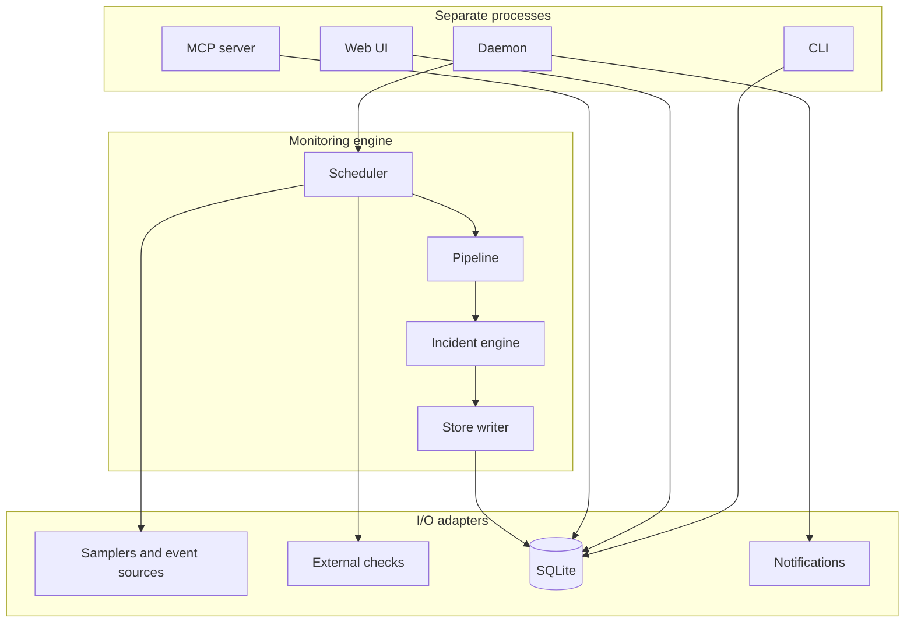

# FTMON v2 — Design

Status: **DRAFT v0.14**. Companion to `SPEC.md` v0.28 — every design element
cites the requirement(s) it satisfies. Where this document says FROZEN,
implementers MUST NOT alter names, signatures, or semantics; changes go through
this document first.

Design-phase artifacts:

- this document;
- `design/builtins/*.toml` — the eight built-in monitor definitions (MD-07), normative;
- two SPEC amendments recorded in SPEC §21 (v0.3): hourly-rollup retention split and event store-filter, both forced by the capacity worksheet (§9 here).

`TESTPLAN.md` and per-milestone work packages are the next phase and build on §16.

## Process overview

FTMON runs as separate processes on one host. The daemon owns sampling and
writes; CLI, web, and MCP share the SQLite store:



---

## 1. Repository and package layout

```
PROJECTS/ftmon/                  # monorepo root (git)
├── .ai/skills/                  # canonical portable contribution skills (AS-*)
│   └── ftmon-add-extra-monitor/{SKILL.md,agents/openai.yaml}
├── SPEC.md  DESIGN.md  TESTPLAN.md(next)  LICENSE(MIT)
├── pyproject.toml  uv.lock      # single Python project at repo root
├── design/
│   └── builtins/*.toml          # normative built-in defs; copied into package data by WP
├── extra-monitors/              # articles + testable external-check recipes (XR-*)
│   ├── _template/
│   └── <recipe>/{README.md,recipe.toml,checks.toml.example,monitor.toml,fixtures/}
├── exchange/                    # static templates/assets; never generated output
├── tools/build_exchange.py      # deterministic, inert catalogue publisher
├── src/ftmon/                   # the package (SPEC §3)
│   ├── paths.py                 # FS-01: all filesystem paths (platformdirs)
│   ├── clock.py                 # TS-03: Clock protocol + SystemClock + ControlledClock
│   ├── model.py                 # §4 core dataclasses (FROZEN)
│   ├── expr/                    # EX-04: stdlib-only, imports nothing from ftmon.*
│   │   ├── parse.py  eval.py  functions.py  tribool.py
│   ├── definitions/
│   │   ├── schema.py            # MD-01 validator (single source of truth)
│   │   ├── loader.py            # TOML → MonitorDef, normalization, topo-sort (MD-08)
│   │   └── builtins/*.toml      # package data, installed by `ftmon init` (FS-02)
│   ├── sources/
│   │   ├── base.py              # Sampler/EventSource protocols + SourceDecl (PL-05)
│   │   ├── process.py disk.py system.py net.py unit.py selfsrc.py
│   │   ├── journald.py          # linux EventSource
│   │   └── fixtures.py          # TS-04 scenario-driven fakes (ship in prod pkg: PL-04)
│   ├── checks/
│   │   ├── registry.py          # administrator argv authority + reload (EC-01/06)
│   │   ├── runner.py            # no-shell process-group deadline (EC-02)
│   │   ├── sampler.py           # fair alias execution + declared projection (EC-04/08)
│   │   └── nagios.py jsoncheck.py # strict output adapters (EC-03/04/10)
│   ├── engine/
│   │   ├── scheduler.py         # SA-01 tick loop
│   │   ├── pipeline.py          # SA-06 source→snapshot→project→derive→rules
│   │   ├── rings.py             # CA-04 ring buffers
│   │   ├── baseline.py          # CA-05
│   │   ├── incidents.py         # IN-06 pure state machine (FROZEN)
│   │   └── effects.py           # effect executor: outbox, actions (AC-*), notify dispatch
│   ├── store/
│   │   ├── db.py                # connection factory, pragmas, migrations runner
│   │   ├── migrations/0001_init.sql …
│   │   ├── writer.py            # daemon-side batched writes
│   │   ├── query.py             # DM-06 tier-transparent reads (shared by CLI/MCP/web)
│   │   ├── retention.py         # DM-04/05 rollups, prune, vacuum
│   │   └── outbox.py            # NO-04
│   ├── notify/                   # adapters + per-channel delivery state
│   │   ├── base.py desktop.py file.py ntfy.py webhook.py smtp.py
│   │   └── dispatch.py           # retry/classification, no incident policy
│   ├── daemon.py                # composition root; owns the only bulk-write connection
│   ├── mcp_server.py            # §13
│   ├── web/                     # §14: operational + isolated demo factories
│   ├── demo.py                  # seeded synthetic DB builder (UI-15/16)
│   ├── systemd/                 # user unit + hardened server system unit
│   ├── selfmon.py               # RB-02 self metrics collection
│   └── cli.py                   # §15 argparse tree, every subcommand
├── tests/                       # §16; mirrors src layout + e2e/ + scenarios/
├── tools/gen_reqindex.py        # TS-01 traceability index generator
└── docs/definitions.md install.md manual.md
```

The original GPLv2 Perl tree remains at
<https://sourceforge.net/projects/ftmon/>. Reused Nagios/Monitoring plugins are
also separately installed external programs. Keeping both out of the MIT
package makes the licensing boundary obvious to users, packagers, and automated
license scanners while retaining an authoritative historical reference.

Layering rule (enforced by a lint test): `expr` imports only stdlib; `model` imports stdlib (+`expr.tribool`); `sources`, `store`, `engine` import `model`/`expr` but never each other except `engine → sources.base`; `daemon`/`mcp_server`/`web`/`cli` are the only modules that may import across the board. No module imports `daemon`.

### 1.1 Dependencies (runtime, pinned by uv.lock)

| Package | Why | Notes |
| --- | --- | --- |
| psutil | samplers | the entire PRECALCS layer |
| platformdirs | FS-01 | |
| mcp | §13 server | official SDK, `mcp.server.fastmcp.FastMCP`, stdio |
| starlette + uvicorn | web UI | small ASGI; no FastAPI (no pydantic needed) |
| jinja2 | web templates | autoescape on (SE-02) |
| tomli-w | writing drafts/normalized TOML | reads use stdlib `tomllib` |

Dev: pytest, pytest-timeout, hypothesis, ruff. Vendored static (MIT/BSD, checked in under `web/static/vendor/`): htmx (~14 kB), uPlot (~50 kB) — chosen as the smallest chart library that renders 2 000-point series fast and lets us attach the UI-09 text alternatives ourselves.

Stdlib bias everywhere else: `argparse` (CLI), `sqlite3`, `tomllib`, `hashlib`, `json`.
Remote notification delivery also stays stdlib-only: `urllib.request` + `ssl`
for bounded HTTPS calls and `smtplib` + `email.message` for SMTP. Avoiding a
general notification framework keeps the supported security and retry surface
small; every adapter is contract-tested against local fakes (NO-05, TS-13).

---

## 2. Runtime composition

```
ftmon daemon ──► Scheduler(clock)
                   │ per tick (5 s monotonic):
                   │ 1. drain EventSources → event pipeline (§11)
                   │ 2. for each due monitor: run pipeline (§10) using shared snapshots
                   │ 3. incident engine step → effects → outbox/actions
                   │ 4. writer.flush()  (ONE write txn per tick, PM-03)
                   │ 5. retention slice (≤1 s, DM-04) ; self metrics (RB-02)
                   └─ ControlledClock hook for tier-1 e2e (TS-05)

ftmon mcp / web / CLI ──► store.query (read) + small-write helpers (ack/approve/draft)
```

The daemon's sampling and incident pipeline is synchronous and single-threaded.
Each `EventSource` owns one reader subprocess/thread that only moves lines into
a bounded deque (SA-08). M8 adds one notification-dispatch thread with its own
SQLite connection; it claims durable delivery rows and performs potentially
slow network I/O wholly outside sampling transactions. Tests replace both
threaded boundaries with synchronous fakes, preserving deterministic control.

Confirm/clear counters (IN-01) are in-memory only; a daemon restart loses in-progress confirmation and re-accumulates (documented, acceptable — incidents and backoff state survive via DB per IN-02/DM-14).

### 2.1 Single-server deployment (PM-08/09)

`ftmon init --profile server` and the packaged `ftmon-server.service` target a
dedicated `ftmon` account with a real, non-login home/state directory. The unit
uses `User=ftmon`, `Group=ftmon`, `NoNewPrivileges=true`, `PrivateTmp=true`,
`ProtectSystem=strict`, `ProtectHome=read-only`, and explicit `ReadWritePaths`
for FTMON's config/data/state directories. `ProtectProc=invisible` is deliberately
not set: hiding other users' `/proc` entries would make process monitoring lie.
The account gains no supplementary groups by default and the service never uses
ambient capabilities. Administrators who need journal coverage grant the
narrow platform group/read ACL themselves and accept that visibility trade-off.
M9 provides `Environment=FTMON_CHECK_REGISTRY=/etc/ftmon/checks.toml`; the unit
does not add `/etc/ftmon` to `ReadWritePaths`. Packaging and real-system tests
assert both facts because application-level “MCP cannot edit this file” is not
a sufficient command-execution boundary on a server (FS-03, EC-01, SE-07).

The operational dashboard still listens on `127.0.0.1:8420`. The documented
remote path is `ssh -L 8420:127.0.0.1:8420 host`; a reverse proxy does not make
the unauthenticated operational UI safe. Desktop user units remain the default
for workstations and are not replaced by the server unit.

---

## 3. Filesystem & configuration (FS-01, PM-06)

`paths.py` exposes a frozen `Paths` dataclass built once from `platformdirs` + `$FTMON_*` env overrides (tests use temp dirs via env). M8 extends the explicit
`config.toml` shape as follows (PM-08, NO-05..10, SE-05):

```toml
[daemon]
tick_seconds = 5
gone_grace = "5m"

[privacy]
collect_cmdline = true

[quiet_hours]
enabled = false
start = "22:30"
end = "07:30"

[web]
port = 8420

[notify.desktop]
enabled = true
min_severity = "info"

[notify.ntfy]
enabled = false
min_severity = "warning"
base_url = "https://ntfy.sh"
topic = "ftmon-hostname"
token_env = "FTMON_NTFY_TOKEN" # or token_file, exactly one when enabled

[notify.webhook]
enabled = false
min_severity = "warning"
url_env = "FTMON_WEBHOOK_URL"  # or url_file; URL often embeds a secret

[notify.smtp]
enabled = false
min_severity = "warning"
host = "smtp.example.net"
port = 587
tls = "starttls"               # starttls | implicit
username = "ftmon@example.net"
password_env = "FTMON_SMTP_PASSWORD" # or password_file
from = "ftmon@example.net"
to = ["operator@example.net"]

```

The file audit channel is mandatory and therefore has no enable switch. An
`*_file` contains only the secret, is opened without following symlinks, must be
owned by the service account and not group/world-readable, and has surrounding
ASCII whitespace stripped. Environment and file forms are mutually exclusive.
Literal `token`, `password`, or webhook `url` keys are rejected rather than
deprecated, because silently accepting them would defeat SE-05. The generated
desktop profile writes desktop enabled; the server profile writes it disabled.
Profile effects are visible text in the generated file and disappear as a
runtime concept after initialization.

M9 provides `Paths.check_registry_file`. It defaults to private
`config_dir/checks.toml` for the desktop/single-user trust model. The hardened
server unit sets `FTMON_CHECK_REGISTRY=/etc/ftmon/checks.toml`; that root-owned
file and its parent remain outside `ReadWritePaths`, so compromising the daemon
cannot grant a new command while monitor/draft management remains writable.
The separate file contains:

```toml
[check.website_https]
argv = ["/usr/lib/nagios/plugins/check_http", "-H", "example.org", "-S", "--sni", "-E"]
protocol = "nagios"
timeout = "10s"
```

`checks.registry.load(path)` first lstat/checks the registry and its parent
chain per EC-01, then validates the whole `[check]` table before
publishing an immutable `CheckRegistry`. Registry aliases use the monitor-name
syntax; `argv` is 1–32 strings (combined UTF-8 ≤ 8 KiB), its first element is an
absolute path, and timeout is 1–30 s. Validation opens the executable with
`lstat`, rejects symlinks/non-regular/non-executable or group/world-writable
files and paths under data/state/runtime, and records only a stable readiness
category. The registry object, not raw TOML, is passed to `ExternalSampler`.
Config reload swaps the complete object only after validation; failure retains
the previous object (EC-01/06/08, SE-07).

There is deliberately no environment table. A generic secret-to-environment
feature would make process output, diagnostics and third-party behavior part of
FTMON's secret boundary. A plugin that needs credentials receives the path to
its own administrator-managed protected file as a non-secret argv value; its
format, ownership and lifecycle remain that plugin's responsibility (EC-07).

Atomic write helper `paths.atomic_write(path, bytes)` (tmp + fsync + rename, 0600) is the only function that writes into the config tree (PM-06a/b); loader rejects symlinks (PM-06c).

---

## 4. Core types (`model.py`) — FROZEN

```python
class TriBool(Enum): TRUE; FALSE; UNKNOWN          # expr/tribool.py, re-exported

@dataclass(frozen=True) class MetricDecl:  name: str; unit: str; kind: Literal["gauge","counter"]; doc: str
@dataclass(frozen=True) class AttrDecl:    name: str; doc: str
@dataclass(frozen=True) class SourceDecl:  # PL-05
    name: str; kind: Literal["sampler","events"]; entity_kind: str
    metrics: tuple[MetricDecl, ...]; attrs: tuple[AttrDecl, ...]

@dataclass(frozen=True) class EntitySample:
    entity_id: str; attrs: Mapping[str, str]; metrics: Mapping[str, float]
@dataclass(frozen=True) class Snapshot:            # SA-06: one ts for all entities
    source: str; ts: float; entities: tuple[EntitySample, ...]

@dataclass(frozen=True) class EventRecord:          # DM-07/08
    ts: float; ingest_ts: float; source: str; provider: str
    event_id: str | None; severity: int; message: str; attrs: Mapping[str, str]

@dataclass(frozen=True) class Notification:        # NO-01
    incident_id: int; kind: Literal["open","escalate","renotify","recover","digest"]
    severity: int; monitor: str; entity_id: str
    title: str; body: str; created_ts: float

# Incident engine I/O (§10.4)
@dataclass(frozen=True) class RungState:   confirmed: bool; confirm_count: int; clear_count: int
@dataclass(frozen=True) class IncidentCore:
    incident_id: int | None; state: Literal["open","acked","cleared"]
    severity: int; owning_rule: str; opened_ts: float
    last_notify_ts: float | None; notify_count: int
    backoff_tier: int; flap_clears: tuple[float, ...]; occurrences: int
@dataclass(frozen=True) class GroupState:  rungs: Mapping[str, RungState]; core: IncidentCore | None

Effect = NotifyEffect(Notification) | ActionEffect(action: str, env: Mapping[str,str]) \
       | RecordEffect(kind: str, detail: Mapping) | PersistEffect(...)   # tagged union via dataclasses
```

---

## 5. Interfaces — FROZEN

```python
class Clock(Protocol):                              # TS-03
    def now(self) -> float: ...                     # wall, UTC epoch seconds
    def monotonic(self) -> float: ...
    def sleep_until(self, mono_deadline: float) -> None: ...

class Sampler(Protocol):                            # PL-01
    decl: ClassVar[SourceDecl]
    def sample(self, now: float, deadline_mono: float, options: Mapping) -> Snapshot: ...
    # now = wall ts to stamp on the Snapshot (samplers never read clocks, TS-03);
    # deadline is cooperative for in-process samplers, hard (kill) for subprocess ones (SA-02)

class DynamicSampler(Protocol):                     # EC-04/05 amendment to PL-05
    def declaration(self, options: Mapping) -> SourceDecl: ...
    def sample(self, now: float, deadline_mono: float, options: Mapping) -> Snapshot: ...
    # external is the sole dynamic implementation; declaration() is composed
    # from fixed plugin_* fields plus validated mappings before expressions compile

class EventSource(Protocol):                        # PL-01, DM-15
    decl: ClassVar[SourceDecl]
    def start(self, cursor: str | None) -> None: ...
    def drain(self, max_items: int) -> tuple[list[EventRecord], str | None]: ...  # (events, new_cursor)
    def alive(self) -> bool: ...
    def stop(self) -> None: ...

class Notifier(Protocol):                           # NO-02
    def deliver(self, n: Notification) -> None: ... # raises NotifyError on failure

# expr — the security boundary (EX-01..07)
def compile_expr(text: str, names: NameEnv) -> CompiledExpr      # raises ExprSyntaxError/ExprNameError
class CompiledExpr:
    windows: tuple[tuple[str, float], ...]          # (metric, seconds) — feeds CA-04 sizing
    def eval(self, ctx: EvalContext) -> float | str | TriBool | None: ...   # NEVER raises (EX-06)
class NameEnv:   # built at validation from SourceDecl + parameters (MD-04, EX-02)
class EvalContext(Protocol):
    def metric_last(self, m: str) -> float | None
    def metric_window(self, m: str, seconds: float) -> Sequence[tuple[float, float]]
    def attr(self, a: str) -> str | None
    def param(self, p: str) -> float
    def baseline(self, m: str) -> float | None
    def now(self) -> float                          # for during()/dow()/age()

# incident engine — pure (IN-06)
def step_group(cfg: GroupConfig, st: GroupState, evals: Mapping[str, TriBool],
               now: float) -> tuple[GroupState, tuple[Effect, ...]]
def step_episode(cfg: EpisodeConfig, st: GroupState, matches: Sequence[EventRecord],
                 now: float) -> tuple[GroupState, tuple[Effect, ...]]           # IN-08

# storage facade (all non-daemon processes use only Query + SmallWrites)
class Query:      # DM-06; shared by CLI/MCP/web
    def series(self, monitor, metric, entity=None, start=..., end=..., max_points=2000) -> SeriesResult
    def current_baseline(self, monitor, entity, metric) -> BaselineRecord | None
    def baseline_history(self, monitor, entity, metric, start=..., end=...) -> BaselineHistory | None
    def list_baselines(self, filters=..., limit=100, cursor=None) -> BaselinePage
    def top(self, resource, start, end, n) -> ...
    def events(self, filters) -> ...
    def incidents(self, filters) -> ...
    def incident_detail(self, id) -> ...            # explain_incident substrate
    def monitors(self) -> ...
    def status(self) -> StatusResult                # PM-01 liveness = age of meta.last_tick_ts
class SmallWrites:
    def ack(self, incident_id, by, note) -> None    # PM-03 short txn
```

`ControlledClock` (tests): listens on `$FTMON_CLOCK_SOCK` (unix socket, line-JSON `{"op":"step","s":5}` / `{"op":"set","wall":…,"mono":…}`); `sleep_until` blocks on the socket; the daemon replies `{"ok":true,"tick":N}` **after** completing the tick, so harness steps are synchronous (TS-05 determinism).

---

## 6. Expression module design (EX-01..07)

- `parse.py`: `ast.parse(text, mode="eval")`; walk with an allowlist visitor (exact node list EX-01, kwargs rejected EX-05); output is a private IR (nested frozen dataclasses) — the evaluator never touches `ast` nodes again. Regexes found in `matches()` are compiled here (EX-07) and pattern length checked.
- Name resolution (EX-02) happens at compile time against `NameEnv`; the IR stores slot kinds (`metric|attr|param|const`) so eval does no dict lookups on strings the author controls.
- `eval.py`: small recursive interpreter over the IR. All binary/unary/compare ops route through `tribool.py` helpers implementing the EX-06 truth table verbatim (one function per table row group; the unit tests mirror the table). Division/modulo by zero, NaN/inf results → `UNKNOWN` + a counter callback. A `deadline_check()` closure is consulted every N=64 IR nodes (EX-03's 10 ms cap).
- `functions.py`: the CA-01 table. Series functions take `(ctx, metric_slot, window_seconds)`; `slope` = numerically stable least squares over (t−t₀); `monot` counts consecutive positive deltas / (n−1); `coverage` = (t_newest − t_oldest)/w clamped to [0, 1] — the window parameter reaches the function for exactly this one case (every other series function only needs the points). `CompiledExpr.windows` is the union of all (metric, window) references — the loader aggregates these per monitor to size ring buffers (CA-04) and to reject > 6 h / >10 000-point windows.
- Message templates (MD-02): validated with `string.Formatter().parse`; allowed field names = same NameEnv; rendering wraps every value — `None` renders as `"n/a"` ignoring any format spec (so `{full_in_h:.1f}` never raises at fire time).

---

## 7. Definition schema and loader (MD-01/03/04/07/08, §8.1)

`schema.py` holds one declarative table (`SCHEMA: dict`) describing every key: type, bounds, required-ness, and per-source-kind applicability. Complete key inventory (normative; JSON-Schema is generated from this table for docs):

| Key | Type / bounds | Applies |
| --- | --- | --- |
| `schema` | int, == 1 (VC-02) | all |
| `monitor.name` | `[a-z][a-z0-9_]{1,31}` | all |
| `monitor.description` | str ≤ 200 | all |
| `monitor.version` | int ≥ 1 | all |
| `monitor.enabled` | bool (default true) | all |
| `monitor.platforms` | subset {linux,windows,darwin} | all |
| `monitor.interval` | duration ≥ "15s" (SA-01) | sampler sources |
| `monitor.source` | name of a registered source, or "events" | all |
| `source_options.watchlist` | array of tables: `{unit=…}` \| `{process=regex}` \| `{listen="tcp:22"}` + optional `during`, `expected=bool` | service, net |
| `source_options.top_n` | int 5..50 (default 15, SA-05) | process |
| `source_options.check` | registered alias | external |
| `source_options.entity` | stable non-empty string ≤ 256 | external |
| `source_options.perfdata[]` | `{label, metric, plugin_uom, unit, kind, scale?}`; ≤32, unique labels/metrics | external |
| `parameters.*` | `{value: num, doc: str}` | all |
| `promotion.expr` | expression (bool) — SA-05(c) heuristic | process |
| `derived[].name/expr` | metric name / expression | sampler sources |
| `glance` | `{metric, unit, aggregate=max|min, thresholds=[{label, parameter}]}`; ≤4 thresholds (MD-12) | sampler sources |
| `trend[]` | declarative value/rate/confidence/projection presentation profile (MD-10) | sampler sources |
| `exempt[]` | expression (bool) over entity ns (CA-07) | sampler sources |
| `rule[].id` | `[a-z0-9-]{1,32}`, unique in monitor | all |
| `rule[].group` | id-syntax; default = rule id (IN-03) | sampler sources |
| `rule[].when` | expression (bool) | all |
| `rule[].severity` | notice\|warning\|error\|critical | all |
| `rule[].confirm_cycles` | int 1..60 (default 1) | sampler rules |
| `rule[].clear_cycles` | int 1..60 (default = confirm) | sampler rules |
| `rule[].message` | template ≤ 200 rendered (NO-01) | all |
| `rule[].action` | bare filename in actions/ (AC-01) | all |
| `rule[].cooldown` | duration (default "10m") | event rules only (IN-08) |
| `rule[].clear_after` | duration (default "30m") | event rules only |
| `rule[].confirm_count` / `confirm_window` | int ≥1 / duration | event rules only |
| `rule[].notify_recovery` | bool (default: false for event rules, true otherwise, IN-04) | all |

Event-rule namespace: `severity, provider, event_id, message, source` + parameters (§7.7.3). Loader pipeline: `tomllib` → schema table check (unknown key = error with dotted path, MD-03) → NameEnv build from `SourceDecl` (PL-05) → compile every expression/template (MD-04 suggestions via `difflib.get_close_matches`) → topo-sort derived (MD-08) → aggregate windows (CA-04) → `MonitorDef` (frozen) + normalized TOML (tomli-w, sorted keys) + SHA-256 hash (PM-04/07).

Registered sources through M9: `process, disk, system, net, unit, self, events,
external`. The `self` source is registered like any other (RB-02). `external`
is the only `DynamicSampler`: `schema.external_decl(mappings)` starts with
`plugin_state, plugin_ok, duration_s` and `plugin_message`, appends mapped
`MetricDecl`s, then builds the NameEnv used by derived/rule/trend validation.
The runtime adapter receives that same frozen mapping tuple, preventing loader
and sampler schema drift (PL-05, MD-11, EC-04/05).

---

## 8. SQLite schema (DDL v1)

Pragmas at open: `journal_mode=WAL, synchronous=NORMAL, foreign_keys=ON, busy_timeout=5000`; DB created with `auto_vacuum=INCREMENTAL` (DM-05). Migrations: numbered SQL files, `PRAGMA user_version` gate, pre-migration backup via backup API (VC-01).

```sql
CREATE TABLE meta(key TEXT PRIMARY KEY, value TEXT) WITHOUT ROWID;
-- keys: schema_hash, last_tick_ts, last_tick_mono, rollup5m_cursor, rollup1h_cursor, db_budget_state

CREATE TABLE series(
  id INTEGER PRIMARY KEY, monitor TEXT NOT NULL, entity_id TEXT NOT NULL,
  metric TEXT NOT NULL, durable INTEGER NOT NULL,            -- §9: 1 = system/disk/self/watchlist
  UNIQUE(monitor, entity_id, metric));

CREATE TABLE samples(   series_id INTEGER NOT NULL, ts INTEGER NOT NULL, value REAL NOT NULL,
  PRIMARY KEY(series_id, ts)) WITHOUT ROWID;                 -- DM-01; ~35 B/row effective
CREATE TABLE rollup5m(  series_id INTEGER NOT NULL, bucket INTEGER NOT NULL,
  avg REAL, min REAL, max REAL, last REAL, cnt INTEGER,
  PRIMARY KEY(series_id, bucket)) WITHOUT ROWID;             -- DM-04
CREATE TABLE rollup1h(  LIKE rollup5m );                     -- (spelled out in migration)

CREATE TABLE entities(  monitor TEXT, entity_id TEXT, first_seen INT, last_seen INT,
  gone_ts INT, attrs TEXT CHECK(length(attrs) <= 4096),      -- DM-03, CA-08
  PRIMARY KEY(monitor, entity_id)) WITHOUT ROWID;

CREATE TABLE events(    id INTEGER PRIMARY KEY,              -- id = ingest order (DM-15)
  ts INT, ingest_ts INT, source TEXT, provider TEXT, event_id TEXT,
  severity INT, message TEXT, attrs TEXT);
CREATE INDEX events_ts ON events(ts);
CREATE INDEX events_prov ON events(provider, severity);

CREATE TABLE incidents( id INTEGER PRIMARY KEY, monitor TEXT, grp TEXT, entity_id TEXT,
  state TEXT, severity INT, owning_rule TEXT, opened_ts INT, last_change_ts INT,
  cleared_ts INT, clear_reason TEXT, ack_by TEXT, ack_ts INT,
  notify_count INT, occurrences INT, flapping INT DEFAULT 0);        -- DM-11
CREATE UNIQUE INDEX inc_live ON incidents(monitor, grp, entity_id) WHERE state != 'cleared';
CREATE INDEX inc_state ON incidents(state, last_change_ts);

CREATE TABLE incident_history(incident_id INT, seq INT, ts INT, kind TEXT, detail TEXT,
  PRIMARY KEY(incident_id, seq)) WITHOUT ROWID;              -- DM-12/13 (cap enforced in code)

CREATE TABLE notifications(
  id INTEGER PRIMARY KEY, incident_id INT NOT NULL, kind TEXT NOT NULL,
  severity INT NOT NULL, title TEXT NOT NULL, body TEXT NOT NULL,
  monitor TEXT NOT NULL, entity_id TEXT NOT NULL, created_ts INT NOT NULL);
                                                               -- DM-14/NO-01
CREATE TABLE notification_deliveries(
  notification_id INT NOT NULL REFERENCES notifications(id),
  channel TEXT NOT NULL, state TEXT NOT NULL,
  attempt_count INT NOT NULL DEFAULT 0, next_attempt_ts INT,
  delivered_ts INT, last_error TEXT CHECK(length(last_error) <= 512),
  PRIMARY KEY(notification_id, channel)) WITHOUT ROWID;         -- DM-18/NO-04..10
CREATE INDEX delivery_due ON notification_deliveries(next_attempt_ts)
  WHERE state = 'pending';

CREATE TABLE baselines( series_id INTEGER PRIMARY KEY, value REAL, updates INT,
  updated_bucket INT, half_life_s REAL NOT NULL DEFAULT 259200) WITHOUT ROWID;
                                                               -- CA-05
CREATE TABLE cursors(   source TEXT PRIMARY KEY, cursor TEXT, updated_ts INT) WITHOUT ROWID;
CREATE TABLE monitor_loads(monitor TEXT, loaded_ts INT, hash TEXT, normalized TEXT,
  PRIMARY KEY(monitor, loaded_ts)) WITHOUT ROWID;            -- PM-07 (keep last 20/monitor)
```

Migration `0003_notification_deliveries.sql` creates the two new tables, copies
each legacy `outbox` row into `notifications`, and creates a `file` delivery:
legacy delivered rows become `delivered`; undelivered rows become `pending`
with `next_attempt_ts=created_ts`; legacy stale rows become terminal `failed`
with the fixed redacted reason `legacy stale delivery`. It then drops the old
table. Remote deliveries are intentionally not backfilled because DM-18 freezes
the channel set when the notification is created. The normal VC-01 backup makes
this destructive table replacement recoverable.

Migration `0004_baseline_half_life.sql` adds
`half_life_s REAL NOT NULL DEFAULT 259200` to existing baseline rows. Retention
stores the effective value at the seed and treats it as immutable for that row's
lifetime: a changed value replaces the row with the new rollup as update one.
That reset is why a single coefficient can reverse every update represented by
the current row without a duplicate baseline-history table (CA-05).

Write path: `writer.py` accumulates the tick's samples/events/incident rows and
commits **one** transaction at step 4 (PM-03). Notifications and their frozen
initial delivery rows are part of that transaction (NO-04/DM-18); the dispatcher
claims and updates delivery state afterward through its own short transactions.
If `BEGIN IMMEDIATE` fails after `busy_timeout` with "database is locked"
(PM-10), `commit_tick` still clears its pending buffers, the daemon counts
`sqlite_lock_errors`, emits a self-event for the next successful tick, and
skips post-commit actions/outbox/retention for the failed tick — it must not
exit.

---

## 9. Capacity worksheet (DM-16) — and the two SPEC amendments

Assumptions (become validation limits): ≤ 400 persisted entities; active persisted series ≈ **270** (top-15 procs × 6 metrics + ~10 promoted × 6 + ~10 watchlist × 6 + disk 6 mounts × 5 + system 12 + net 8 + self 12); 60 s intervals; WITHOUT ROWID sample row ≈ 35 B, rollup row ≈ 45 B effective (incl. b-tree overhead); stored events ≈ 2 000/day at ≈ 350 B.

| Store | Rows | Size |
| --- | --- | --- |
| raw 48 h | 270 × 2 880 ≈ 0.78 M | ≈ 27 MB |
| 5-min 30 d | 270 × 288 × 30 ≈ 2.33 M | ≈ 105 MB |
| 1-h, durable series (≈ 90) × 400 d | 0.86 M | ≈ 39 MB |
| 1-h, process series × **90 d** | ≈ 0.39 M | ≈ 18 MB |
| events 30 d (filtered) | 60 k | ≈ 21 MB |
| incidents + history + misc | — | ≈ 5 MB |
| **Total steady state** | | **≈ 215 MB → DM-05 trims 5-min tail to land < 200 MB** (effective ~27 d of 5-min data; honest and self-correcting) |

Two findings forced SPEC amendments (recorded as v0.3):

1. **Hourly rollups for all series for 400 d** would cost ≈ 115 MB alone (process-entity churn). Amended DM-04: 400 d hourly retention applies to *durable* series (system, disk, self, watchlist-synthetic); process-sourced series keep 90 d hourly.
2. **Storing all journal events** (50–200 k lines/day on a desktop) would blow the budget within days. Amended DM-09: the event store-filter keeps events with severity ≥ notice **or** matching any loaded event rule; info-level non-matching events are counted (self-metric) but not stored. Configurable `store_min_severity`.

Ring-buffer RAM (CA-04): worst case all-processes window = 300 procs × 2 metrics × 15 samples × 32 B ≈ 0.3 MB; promoted/watchlist long windows: 40 series × 720 points × 32 B ≈ 0.9 MB; comfortably inside the 64 MB cap; cap exists for pathological definitions.

---

## 10. Engine design

### 10.1 Scheduler (SA-01, SA-07)

`scheduler.py` keeps `next_due: dict[monitor, float]` on the **monotonic** clock. Loop: `clock.sleep_until(next_tick)` → detect monotonic gap > 2×tick → emit `clock_gap` self-event and re-anchor all `next_due` (skip, don't catch up) → run tick. Wall-time is read once per tick (`tick_wall_ts`) and stamped on all samples from that tick.

### 10.2 Pipeline per due monitor (SA-06)

```
snapshot = snapshot_cache.get_or_run(source, deadline)   # once per source per tick
entities = project(snapshot, monitor)                    # + synthetic watchlist entities
rings.append(monitor, entities)                          # CA-04
for d in monitor.derived_topo: rings.append_derived(d.eval(ctx))
alive = {e for e if not exempt(e)}                       # CA-07
evals = {(rule, e): rule.when.eval(ctx(e)) for ...}      # TriBool
for (group, e): step_group(...) → effects                # §10.4
persist: non-exempt samples selected by SA-05; purge prior state for exemptions
gone-detection: entities seen before but absent → CA-08 grace timer
```

### 10.3 Promotion (SA-05)

The process source keeps its own all-process short window (15 samples) in `rings` under a non-persisted namespace. After each cycle, `promotion.expr` (from `leak.toml` et al.) is evaluated per process against that window; newly-true → promote (start persisting + full ring), false for 30 min → demote. Transitions → self-events.

### 10.4 Incident engine (IN-01..08) — pure

`step_group` implements the SPEC §9.1 diagram exactly; `GroupConfig` carries per-rung `severity, confirm, clear, message-template-id, action, notify_recovery` + backoff table `(300, 900, 3600, 21600)` (IN-02). Backoff/renotify decisions derive from `IncidentCore.last_notify_ts/backoff_tier` — the caller rebuilds `IncidentCore` from DB at startup, which is how restarts keep the schedule (IN-02). The same rebuild pass seeds the pipeline's disappearance tracking (`seen[entity_id] = stored last_seen`) for each open incident's discovered entity (IN-09): the ordinary CA-08 grace path then clears entities that vanished during downtime — no second clearing mechanism exists. `step_episode` shares `IncidentCore` and differs only per IN-08 (cooldown gate, `clear_after` timer via `now − last_seen`). Effects are executed by `effects.py`: `NotifyEffect` creates the immutable notification and its eligible delivery rows in the incident transaction, then the dispatcher attempts due rows post-commit; `ActionEffect` → AC-02 subprocess with env, recorded to history.

### 10.5 Baselines & retention slices

`baseline.py` hooks the 5-min rollup job: for each rolled bucket, apply the CA-05 EW update (`α = 1 − 2^(−300/259200)` per 5-min step at the 3 d half-life), increment `updates`. `retention.py` runs ≤ 1 s/tick with cursors in `meta`: rollup 5m → rollup 1h → prune per DM-05 order → `incremental_vacuum(200 pages)`. Weekly full VACUUM only when daemon idle and DB fragmented > 20 %.

### 10.6 Self source (RB-02)

Metrics: `cpu_pct, rss_bytes, db_bytes, cycle_s, sampler_s{per-source attr},
tick_overruns, event_queue_depth, events_dropped, events_unstored,
ring_mem_bytes, source_activity_age_s, eval_unknown_total, samples_rejected,
external_checks_skipped, external_check_failures{category attr},
external_perfdata_rejected{category attr}`. Fed from a `SelfStats` struct the
daemon updates in place; sampled like any source.

### 10.7 Notification fan-out and retry (DM-18, NO-04..10)

`Notifier.deliver(notification) -> DeliveryResult` returns success or raises a
typed `RetryableDelivery` / `PermanentDelivery`; adapters never update SQLite.
`dispatch.py` runs one worker thread with its own SQLite connection. It claims
one due delivery oldest-first in a short transaction by changing `pending` to
`sending`, performs the adapter call without a transaction, then commits the
outcome and claims the next row. A condition wake-up after incident commit avoids
polling latency; a bounded one-second poll is the lost-wakeup fallback. At
startup every `sending` row returns to `pending`, which is the explicit crash
window behind NO-04's possible duplicate. The mandatory file adapter is ordered
first by channel priority and is represented by a delivery row, keeping audit
behavior on the same durable path.

The retry delay table is `(30, 120, 600, 3600, 21600)` seconds, indexed by the
completed attempt count and capped by `created_ts + 86400`. HTTP classification
is fixed by NO-07; a valid integer or HTTP-date `Retry-After` is clamped to
`[now + scheduled_delay, created_ts + 86400]`. Adapter error text is normalized
to a fixed category plus status code and capped at 512 characters before it
reaches SQLite. Response bodies, exception representations, credential values,
and complete URLs are never persisted.

File-delivery failure is the exception to the remote 24-hour cap: it retries at
the 6-hour ceiling until storage recovers because the audit copy is mandatory.
Desktop readiness is validated before rows are created; a runtime `notify-send`
timeout is retryable and other non-zero exits are permanent. These rules avoid
an absent desktop session creating an endless queue on a server.

The ntfy adapter POSTs the rendered title/body to
`{base_url}/{urlquoted_topic}` with a fixed, control-free `FTMON <severity>` title,
priority (`info=2, notice=3, warning=4, error|critical=5`), tags
(`ftmon`, kind, severity name), and `Authorization: Bearer …` headers; monitor
data never enters the URL. The generic webhook POSTs `application/json` schema
`ftmon.notify.v1`.
SMTP constructs a plain-text `EmailMessage`, performs TLS before authentication,
and classifies standard SMTP response families. Adapters share one hardened
HTTP opener that rejects HTTPS-to-HTTP redirect and caps response reads at 8 KiB.
The contract follows ntfy's documented
[publish/token API](https://docs.ntfy.sh/publish/); operator documentation links
its [retention/privacy behavior](https://docs.ntfy.sh/privacy/) so choosing the
public service is an informed data-egress decision rather than a silent default.

`ftmon doctor` resolves secret references and validates non-secret structure but
reports only `ready`, `disabled`, or a stable error code. Delivery counters
(`pending`, `failed`, age of oldest pending, failures by channel) join the self
source and `/self` page; this makes a broken notification path observable
without recursively notifying about notifier failure.

The existing 30-second rescan also compares the `config.toml` file stamp. A
changed valid file constructs a complete adapter snapshot, reconfigures the one
worker at an attempt boundary, then changes the writer's policy for future
notifications. Existing delivery rows are never added retroactively. A malformed
or removed file retains the last known-good snapshot; a valid but individually
invalid channel fails closed while the other channels reload (NO-10).

`SIGHUP` triggers this same rescan out of cycle (PM-11): the handler sets a
flag on `DaemonCore` and the top of the next tick consumes it — the handler
itself never touches the filesystem or database, so it cannot race the tick
loop or block in a signal context. The packaged daemon units map it to
`ExecReload=`.

### 10.8 External check execution and projection (EC-*, MD-11, SE-07)

The cache key for ordinary sources remains the source name. For `external`, it
is `(source, check_alias)`: all due monitors referencing one alias receive the
same immutable `RawCheckResult`, while each monitor projects only its declared
performance mappings. This preserves SA-06's run-once guarantee without making
one definition's schema authoritative for another.

```python
@dataclass(frozen=True)
class CheckSpec:
    alias: str
    argv: tuple[str, ...]
    protocol: Literal["nagios", "ftmon-json"]
    timeout_s: float

@dataclass(frozen=True)
class RawCheckResult:
    state: int                 # 0 OK, 1 warning, 2 critical, 3 unknown
    message: str               # control-free, <= 2 KiB
    duration_s: float
    values: Mapping[str, tuple[float, str]]  # raw label -> (value, UOM)
    failure: str | None        # fixed category, never raw stderr/exception

@dataclass(frozen=True)
class PerfMapping:
    label: str
    metric: str
    plugin_uom: str
    unit: str
    kind: Literal["gauge", "counter"]
    scale: float
```

`CheckRunner.run(spec, deadline_mono)` uses `subprocess.Popen` rather than
`subprocess.run` so timeout can send TERM then KILL to the new session/process
group. It supplies `stdin=DEVNULL`, captured pipes, `start_new_session=True`,
`close_fds=True`, `cwd=state_dir`, and exactly `PATH=os.defpath` plus fixed
non-secret identity fields (`FTMON_CHECK_ALIAS`, `FTMON_CHECK_TIMEOUT`). A pair
of bounded readers drains stdout/stderr to prevent pipe deadlock while retaining
at most 64 KiB/8 KiB; adapter input over the protocol cap fails closed. Stderr
is discarded after categorization. No DB transaction spans launch or wait.
Immediately before `Popen`, the runner repeats executable `lstat`, resolved-path,
owner and mode checks; a changed target returns categorized unknown instead of
relying on the registry loader's earlier observation.

`nagios.parse()` consumes only the first UTF-8 stdout line. It splits once on
`|`, normalizes exit status, strips ASCII controls from the summary, and parses
space-separated perfdata with a small scanner supporting Nagios single-quoted
labels and backslash-free values. It never uses shell tokenization. Threshold,
minimum and maximum fields are syntax-checked then discarded: exit status
already represents the plugin threshold decision, while FTMON rules remain
explicit. Duplicate raw labels are marked ambiguous and unavailable to every
mapping of that label. `jsoncheck.parse()` strips surrounding ASCII whitespace,
then applies EC-10 with `json.loads` plus
exact type/key/depth/count checks; Python booleans are rejected before numeric
coercion.

Projection always emits `plugin_state`, `plugin_ok`, and `duration_s`. For each
mapping it looks up one raw value, requires an exact UOM match, multiplies by
finite `scale`, rejects non-finite output, and emits the mapped metric. Missing
or rejected labels are omitted so expression lookup returns `None`. The
human-readable message is an attr, not a metric. Existing pipeline, storage,
query, Metrics and Trend code needs no external-check special case after this
projection boundary (EC-04/05).

The scheduler maintains a rotating alias cursor. It runs due aliases
sequentially until the shared source deadline, caches successes and unknown
results for the tick, and counts unstarted aliases as `external_checks_skipped`.
The next tick begins after the last considered alias, preventing a slow first
check from starving later checks. Timeout/launch/protocol failures increment
categorized `external_check_failures`; Nagios state 3 does not. Registry reload
shares the config rescan boundary used by notifications but swaps an all-valid
`CheckRegistry` independently, so one malformed change cannot silently alter
existing execution authority (EC-06/08).

---

### 10.9 Extra-monitor recipe catalogue (XR-*, TS-16)

Each non-underscore directory below `extra-monitors/` is a self-contained
compatibility claim. Markdown carries operator reasoning and machine-readable
`recipe.toml` carries only bounded catalogue metadata and fixture expectations.
Keeping both avoids two failure modes: prose-only examples silently rot, while
configuration-only examples omit the security, licensing and threshold reasons
an operator needs to trust them.

`tests/extra_monitors/test_recipes.py` discovers recipes rather than maintaining
a second index. It validates exact manifest keys, required article headings,
HTTPS upstream and licence metadata, registry/definition alias agreement,
external-definition schema, privilege shape and deterministic adapter output.
It never loads the registry through `checks.registry` because example
executables are intentionally not installed in CI; executable readiness remains
an operator responsibility verified by `doctor` on the target host.

Fixtures are captured protocol output, not golden FTMON database snapshots.
They prove the volatile third-party boundary—exit state, labels and UOM—while
the central TS-15 journey already proves projection through history, incidents
and Trends. Network, hardware and installed-plugin checks stay opt-in so the
default suite remains deterministic and does not turn upstream availability or
root access into a merge gate.

Repository-maintained scripts are the exception to the no-vendoring rule. They
live under their recipe's `scripts/`, carry an explicit licence header, depend
only on documented platform tools or the Python standard library, and have
direct behavioral tests in addition to protocol fixtures (XR-05).

### 10.10 Static Exchange publisher (XR-06..10, TS-19)

`tools/build_exchange.py --output dist/exchange` reads only regular files from
non-underscore recipe directories, validates the same bounded metadata used by
TS-16, then writes into a newly created destination. It refuses a destination
inside `extra-monitors/`, symlinks anywhere in a recipe, duplicate IDs or
generated paths, unsafe URL schemes and unsupported Markdown. The builder does
not import recipe modules, invoke commands, inspect executables or access the
network. This keeps a catalogue contribution a data-review problem rather than
a CI code-execution boundary.

The renderer uses Python's HTML escaping plus a deliberately small Markdown
subset (headings, paragraphs, fenced code, lists, inline code and HTTPS links).
Raw HTML is text, not markup. Templates are repository-owned constants rather
than contributor-selectable files. Output is ordered by recipe ID and JSON uses
sorted keys and fixed separators, so two builds of one tree are byte-identical.

The artifact contains `index.html`, `recipes/<id>/index.html`,
`search-index.v1.json`, repository-owned `assets/exchange.css` and
`assets/exchange.js`, plus `404.html`, `.nojekyll` and `CNAME`. The index renders
all cards and filter links in HTML; JavaScript only narrows that existing list
from the versioned search document. Detail pages show compatibility and trust
metadata before the safely rendered article, and link to reviewed source on
GitHub rather than copying or offering a third-party executable.

`.github/workflows/exchange.yml` builds and tests on pull requests and pushes.
The deploy job additionally requires `github.ref == refs/heads/main` and a push
event, depends on the build artifact, targets the protected `github-pages`
environment, and alone receives `pages: write` plus `id-token: write`. Workflow
actions are pinned to immutable revisions because a documentation publisher is
still a software supply-chain boundary. Pages terminates TLS for the verified
`exchange.ftmon.org` custom domain; DNS and rollback remain operator steps.

### 10.11 Shared contribution skills (AS-*, TS-20)

`.ai/skills/` is a neutral repository namespace rather than a discovery path
claimed to work automatically in every agent. Each skill follows the common
filesystem shape with a concise `SKILL.md`; optional `agents/openai.yaml` is UI
metadata and never changes workflow semantics. No schema, template or plugin
reference is copied into bundled resources: the skill reads live repository
files so a SPEC change cannot leave a hidden second contract behind.

`ftmon-add-extra-monitor` is the only initial shared skill because that workflow
is frequent, externally contributed and crosses the most trust boundaries. It
branches between an observed Nagios first-line/exit-code adapter and strict
FTMON JSON, then rejoins for mappings, incidents, Trends, recipe evidence,
Exchange publication and tests. It does not scaffold files itself; using the
reviewed `_template` through normal agent edits keeps changes visible in the
diff and avoids giving a helper script implicit write authority.

`tests/ai_skills/test_shared_skills.py` treats skills as inert UTF-8 text. It
checks portable frontmatter and bounded structure, resolves backtick repository
paths, verifies commands name existing tools/test directories, and asserts the
critical concepts that make the workflow safe. This deliberately avoids a
vendor SDK: native discovery is smoke-tested by users of that product, while CI
protects the shared semantic core.

Installation remains explicit. Codex users link/copy the skill directory into
`${CODEX_HOME:-$HOME/.codex}/skills/`; Claude Code users link/copy it into
`~/.claude/skills/` or a checkout-local `.claude/skills/`. These are generated
adapters in ignored/personal locations, never separately committed skills.

---

## 11. Event pipeline (SA-03/08, DM-07..10, DM-15)

`journald.py`: spawns `journalctl -f -o json --output-fields=MESSAGE,PRIORITY,SYSLOG_IDENTIFIER,_SYSTEMD_UNIT,__CURSOR [--after-cursor=C]`. Reader thread appends raw lines to deque. `drain()` (main thread): parse JSON (malformed → count, skip), normalize → `EventRecord` (severity map: PRIORITY 0–2→critical, 3→error, 4→warning, 5→notice, 6–7→info; provider = `_SYSTEMD_UNIT` else `SYSLOG_IDENTIFIER`), return last `__CURSOR`. Cursor is persisted in the tick's write txn (DM-15). Storm counter per (source, provider) sliding minute (DM-10); store-filter per amended DM-09; matching against loaded event rules uses the same compiled `when` expressions with the event-field NameEnv. Reader death → `alive()` false → scheduler restarts with backoff (SA-03).

---

## 12. Query layer (DM-06, UI-05)

Tier choice: `end > now−48h and span ≤ 12h` → raw; `span ≤ 30d` → 5m; else 1h — then if points > max_points, server-side LTTB downsample to max_points (used by web charts and MCP alike). All timestamps out are UTC ints + one `tz: "<IANA>"` field per response (MC-02).

Baseline reads join `baselines` to `series`. `current_baseline` returns the
stored level even below the 240-update rule gate together with capped coverage,
readiness, update bucket and effective half-life. `baseline_history` starts at
that current row and walks retained `rollup5m.avg` rows newest-first, applying
`b_previous = (b_current − α·rollup_avg) / (1−α)` at most `updates−1` times.
The seed is never reversed. Returned points retain their five-minute bucket
timestamps; the first requested bucket is `ceil(start/300)·300`, and history is
truncated only when that bucket precedes the earliest reconstructable point and
the seed was not reached. Missing buckets remain gaps.

`list_baselines` orders all stored rows by `(monitor, entity_id, metric)` and
uses an opaque keyset cursor containing both the last key and canonical exact
filters. The default page is 100 rows and the hard maximum is 500; malformed,
filter-mismatched or out-of-range requests fail rather than clamp. This shared
page contract serves MCP and the Baselines web index (MC-07/UI-02).

---

## 13. MCP server (`mcp_server.py`, MC-01..07)

FastMCP over stdio; every tool = thin wrapper on `Query`/`SmallWrites`/`definitions`. Parameter schemas (FROZEN; `range` = duration string or `[iso, iso]`):

| Tool | Params (required bold) | Returns |
| --- | --- | --- |
| get_status | — | daemon alive/last_tick_age, monitors[], open_incidents, self_metrics |
| query_metrics | **monitor, metric, range**; entity, agg(avg\|min\|max\|last), filter_expr | series[] {entity, points[[ts,v]]}, resolution, tz |
| top_consumers | **resource(cpu\|rss\|io), range**; n=10 | ranked[] {entity, attrs, agg_value} |
| get_process_history | **name_or_pid, range** | entities[] {entity_id, attrs, first/last/gone, series{…}} |
| list_events | **range**; min_severity, provider, match_expr, limit=200 | events[] |
| list_incidents | — ; state, range, monitor | incidents[] summary |
| explain_incident | **id** | rule text+params, series ±window, events ±10 m, history[] |
| list_monitors / get_monitor | — / **name** | defs + state + validation + load history |
| monitor_paths | — | {config_dir, monitors_dir, drafts_dir, actions_dir, check_registry, data_dir, db_file, state_dir} — mirrors `ftmon paths --json` (MC-06/CL-06) |
| diagnose_monitor | **name** | {found(enabled\|disabled\|draft\|missing), path, valid, errors[], last_load{hash, age_s}, check{alias, registered, executable_trusted}, last_result{entity_id, plugin_state, plugin_ok, plugin_message, duration_s, sample_age_s}\|null} — booleans/categories and stored EC-05 fields only, never argv (SE-07); `last_result` null when non-external / no DB / configured entity never sampled |
| list_baselines | monitor, entity, metric, ready, limit=100, cursor | {tz, baselines[]{monitor,entity,metric,level,updates,required_updates,coverage,ready,updated_at,half_life_s}, next_cursor}; all stored rows, exact filters, opaque filter-bound keyset cursor (MC-07) |
| validate_monitor | **toml_text** | {ok} \| {errors[]: {path, code, message, hint}} |
| define_monitor | **toml_text** | {draft_path, approval_hint, next_steps[] {via(cli\|web), action}} \| errors as above |
| ack_incident | **id**; note | {ok, incident} |

Errors: `{code, message, hint}` (MC-04) with codes `invalid_params, validation_failed, not_found, name_exists, daemon_stale`. Resources (MC-05), force-included from their canonical sources into `ftmon/docs/` in the wheel and loaded with `importlib.resources`: `ftmon://docs/definitions` → `docs/definitions.md`; `ftmon://docs/check-authoring` → `docs/check-authoring.md`; `ftmon://docs/external-checks` → `docs/external-checks.md`. A checkout-relative read is only the editable-development fallback.

---

## 14. Web UI (`web/`, UI-01..09)

Starlette app; Jinja2 (autoescape); a body `data-refresh-ms` contract plus the
small vendored script performs full-page polling: dashboard, incident and
Events views every 5 s, Monitors and Self every 15 s (UI-04). Metrics, Trends
and Baselines do not auto-refresh so chart state and long-form inspection stay
stable. uPlot charts are fed by `/api/series` (JSON from `Query`, ≤ 2 000 pts).
Both web middlewares call one response-header helper. Operational middleware
also enforces the exact Host allowlist and matching POST Origin. The shared
headers are the SE-02 CSP (`default-src 'self'`, `frame-ancestors 'none'`,
`form-action 'self'`, `base-uri 'none'`), `nosniff`, `DENY` framing, no-referrer,
CORP same-origin and COOP same-origin; neither middleware emits CORS (UI-08).

Routes: `GET /` dashboard · `GET/POST /incidents[/{id}][/ack]` · `GET /metrics` explorer (state in query string, UI-02) · `GET /baselines` read-only index · `GET /events` · `GET /monitors`, `POST /monitors/{name}/(enable|disable|approve|delete-draft)` · `GET /self` · `GET /api/series`. Templates: `base.html` + one per page; severity rendered as `<span class="sev sev-error">▲ error</span>` (icon + text, UI-09); charts carry a server-rendered text alternative. The locally packaged FTMON mark supplies the header image, PNG/ICO favicons, and touch icon without weakening UI-01's offline guarantee. Its header image is decorative beside a real-text wordmark so branding cannot obscure the home link's accessible name or become unreadable when images fail.

Metrics payloads always include `baseline`: null when the selected persisted
series has no CA-05 row, otherwise the current record plus native five-minute
`points[[ts,value]]`, explicit exact-300-second `runs`, and range-relative
`history_truncated`. The panel's `y_domain` is calculated from all finite
metric, envelope and baseline values, with 0..100 retained as the minimum
percent domain and deterministic padding for other/constant ranges. Browser
rendering strokes each supplied run dashed and paints its native points; it
never step-holds onto raw timestamps, spans a larger gap, interpolates hourly
history, or draws the current level across an unobserved range. A visible
Baseline key and the accessible summary carry learning/readiness, level,
coverage and truncation even when no historical run falls in range
(UI-13/TS-11).

`GET /baselines` applies the same exact filters, 100/500 row bounds, opaque
filter-bound keyset cursor and ordering as MC-07. Invalid limits and cursors are
HTTP 400, while each row links to the matching shareable Metrics selection.
The page has no POST route; CA-06 reset remains CLI-only (UI-02/03).

### 14.1 Public synthetic demo (UI-15/16, SE-06)

Demo mode is a separate application factory, `create_demo_app`, rather than a
boolean checked inside mutating handlers. It imports `Query` but not
`SmallWrites`, definitions writers, actions, daemon, or MCP. Its route list is
an allowlist of the normal GET/HEAD page, partial, static, and series handlers;
Starlette therefore returns 404/405 for every mutation path. A response banner
and `<meta name="robots" content="noindex,nofollow">` distinguish synthetic
content and keep parameterized explorer URLs out of search indexes.

`ftmon demo build --output PATH` replays the packaged, versioned
`scenarios/demo-v1.jsonl` with a fixed clock and seed into a new temporary DB,
runs retention/rollups, verifies UI-16 coverage, fsyncs, then atomically renames
the completed file. The demo web process opens it with SQLite URI
`mode=ro&immutable=1`; it refuses the normal XDG database path, a non-regular
file, group/world-writable input, or a database missing the `demo_dataset=1`
meta marker and expected scenario version. No visitor state is stored. The seed
includes one learning and one ready baseline with matching retained five-minute
rows so Metrics and the Baselines index exercise both visibility states without
operational data (UI-16).

The CLI is explicit:

```sh
ftmon web --demo --demo-db /var/lib/ftmon-demo/demo.db \
  --demo-host demo.ftmon.org --port 8420
```

It still binds `127.0.0.1`. Demo middleware accepts exactly
`Host: demo.ftmon.org` (optional `:443` after normalization), ignores forwarded
Host/Origin authority, caps request targets at 4 KiB, and emits the same shared
security headers as the operational app. Startup fails if `--demo-host` is absent, is an
IP/localhost name, or contains a wildcard.

The reference deployment uses a dedicated `ftmon-demo` account, a systemd
oneshot database builder before the read-only web service, and Caddy bound to
80/443 for automatic HTTPS and reverse proxying to loopback. The hosting layer
must additionally cap request rates/concurrency; the backend remains bounded by
the 2,000-point query limit and immutable DB. A daily timer rebuilds then
restarts the service, although correctness never depends on visitor-state reset.
The demo has no operational daemon, notification credentials, writable actions,
MCP server, or backup job.

Caddy is chosen for the reference deployment because a hostname enables
[automatic public HTTPS](https://caddyserver.com/docs/quick-starts/reverse-proxy)
without a separate certificate-renewal mechanism; it supplies transport, not
application trust, which remains enforced by the demo Host and read-only rules.

---

## 15. CLI (`cli.py`, CL-01..05)

argparse tree; every subcommand is a function taking `(Paths, Query|…, argparse.Namespace)` so tests call them directly. Mapping: `daemon→daemon.run`, `mcp→mcp_server.run`, `web→web.run|web.run_demo`, `demo build→demo.build`, `init --profile→definitions.install_builtins + explicit config scaffold`, `check→definitions.check_cli` (CL-02), `status/top/incidents/incident/events/query/monitors→store.query` renderers (each with `--json`, CL-03; `status` exit codes per CL-04), `ack/monitor approve|enable|disable→SmallWrites/definitions`, `baseline reset→store`, `doctor→store.doctor` (CL-05: quick_check/--deep, WAL checkpoint, sizes, cursor and delivery ages, channel readiness, orphans, `--backup` via `sqlite3.Connection.backup`).

### 15.1 Generic historical trends (M7.1, MD-10/CA-10/UI-12)

`MonitorDef.trends` is a tuple of frozen `TrendProfile` values validated by the loader. A profile is presentation metadata over persisted series, never an executable expression and never a reason to collect more data. Frozen fields: `id, kind, title, value_metric, value_unit, rate_metric, rate_unit, confidence_metric, confidence_threshold_param, remaining_metric, value_threshold_params, rate_threshold_params, incident_group`.

The generic view uses up to four synchronized panels: required value and signed-rate panels, optional confidence on a fixed 0..1 scale, and optional qualified time remaining. `null` means the concept is not meaningful for the profile; an existing panel with empty points means data has not arrived. Separate panels preserve distinct units and failure modes while synchronized cursors retain temporal correlation.

`Query.trend(monitor, entity, profile, …)` returns explicit units, resolution, coverage, declared thresholds and group-filtered incident markers. Projection uses persisted rate + remaining + optional confidence and never differentiates display points or fills absent buckets. `Query.disk_trend` remains a v0.x compatibility adapter.

Routes: `GET /trends[/{monitor}/{profile}]?entity=…&range=…` and `GET /api/trend?monitor=…&profile=…&entity=…&range=…`. `/disks` redirects to `/trends/disk/space_growth`. Dashboard, monitor and incident links all target this same explorer rather than creating alternate render/query paths.

Reference profiles prove both shapes: disk `space-growth` supplies all four panels; leak `rss-growth` supplies value/rate/confidence and explicit `projection: null`. A process has no single honest capacity ceiling because host memory, swap, cgroups and the OOM killer differ, so FTMON refuses to invent one.

### 15.2 Metrics versus Trends (M7.2, UI-13)

Metrics and Trends share one uPlot adapter, series-envelope JSON shape, cursor/time-axis behavior, incident-marker plugin, and server-rendered text-summary rules. Sharing is a correctness decision, not merely visual consistency: two renderers previously disagreed about time axes, gaps, long-range rollups, and interaction, making the diagnostic view a poor way to verify a Trend.

Their semantics remain deliberately separate. `/metrics` selects one persisted `(monitor, entity, metric)` and a rollup statistic; it reports observations and never infers that a name containing `slope`, `pct`, or `rate` has special meaning. `/trends` joins only definition-declared panels and may qualify confidence or projection. A matching-profile link is navigation, not automatic interpretation inside Metrics.

`GET /api/series?monitor=…&entity=…&metric=…&range=…&statistic=…` returns `{monitor, entity, metric, unit, statistic, resolution, points, lower, upper, incidents, summary, matching_trends}`. Raw metric units come from `SourceDecl`; derived units come from explicit trend-profile use when available, otherwise the neutral label `value`. Server-side Query remains authoritative for tier selection, envelopes, incident filtering, and the 2 000-point cap.

### 15.3 Dashboard health tiles (M7.3, UI-14/UI-17)

The dashboard composition root builds a `MonitorTile` view model rather than embedding policy in Jinja: `{name, description, state, icon, label, incident_count, max_severity, trend_profiles, glance?}`. State precedence is evaluated once in Python as `config_error > stale_or_unknown > disabled > error_or_critical > notice_or_warning > clear`; templates only render it. Centralizing precedence prevents a CSS class or loop ordering change from silently turning a broken monitor green.

“Live incident” includes both `open` and `acked`: ack suppresses renotification but is not recovery (IN-02). Staleness overrides enabled/incident display because old database state cannot prove current health. A successfully loaded monitor with no committed load/sample evidence is also unknown; `monitor_loads`, series, or an event cursor provides evidence that it has participated in a daemon cycle. Invalid definition files become config-error tiles even though no `MonitorDef` exists.

CSS state classes restore the legacy green/yellow/red scan pattern via left-edge
accents and soft washes (healthy tiles stay quiet so problems read first), and
every tile also carries a stable glyph and text label. The dashboard sorts tiles
attention-first, splits clear monitors into a quieter section, and keeps an
intentionally disabled monitor without a retained incident in a separate
inactive section. A disabled monitor with a live incident remains prominent.
That ordering is presentation only and never recomputes UI-14 state. Summary
severity comes from the same live incidents as the tiles, including synthetic
demo incidents. No state flashes: motion
is unnecessary for urgency, hostile to reduced-motion users, and makes a
workstation dashboard distracting. Incident links use `/incidents?monitor=…`,
the same Query filter as CLI/MCP.

`MonitorDef.glance` is frozen presentation metadata, not executable policy and
not a reason to collect another metric (MD-12). A focused read-only Query call
finds each active entity's latest raw sample for the declared metric, rejects
samples older than twice the monitor interval, evaluates the definition's
CA-07 exemptions using persisted raw windows, attributes, parameters and
baselines, then selects `max|min` with newest-timestamp then entity-ID
tie-breaking. Rollups and entities with
`gone_ts` are excluded because a retained historical value cannot describe the
host now. Python resolves the declared threshold parameters and composes the
optional tile value; Jinja never aggregates, checks freshness or guesses a
unit. Unknown, disabled, config-error and globally stale tiles omit glance, so
UI-14 remains the sole health-state contract (UI-17). This adds no database
migration, daemon write, tick-path computation or incident-state transition.

Reference definitions deliberately choose like-for-like signals: disk maximum
used percent; load five-minute CPU PSI; hog maximum five-minute CPU; leak
maximum RSS growth rate; temperature hottest Celsius value; and iowait its
fifteen-minute average. Threshold labels appear only when their parameter uses
the same metric and window. Status-only recipes such as `sensors` omit glance
instead of inventing a numeric interpretation.

#### M7 disk reference profile

The disk detail view uses three synchronized uPlot panels rather than one overloaded dual-axis chart:

1. capacity (`used_pct`) with notice/warning/error thresholds and the selected rollup's min/max envelope;
2. signed `fill_rate_bph` with a zero line, plus `filling` on its own fixed 0..1 confidence scale;
3. qualified hours-to-full, rendered as gaps whenever projection prerequisites fail, with incident transition markers shared across all panels.

Separation is deliberate: percentage, bytes/time, confidence, and time remaining have different units and failure modes. Putting them on one axis makes cleanup look like growth and enormous sentinel forecasts dominate autoscaling. Synchronized cursors preserve correlation without conflating scales.

`disk.toml` adds the persisted derived metric `fill_rate_bph = slope(used_bytes, "70m") * 3600`. Persisting the signed rate means long-range charts use the value evaluated against the original ring window, not a derivative of visually downsampled points (DM-17). `full_in_h` remains available for compatibility, but the trend API converts unqualified values to `null`; no database migration is required because derived metrics already use the generic series tables. Pre-amendment history simply has no rate series and is reported as unavailable rather than reconstructed inaccurately from coarse rollups.

`Query.series` gains keyword-only `statistic="avg"` and `include_envelope=False`. Raw points use their value for every statistic; rollups select the named stored column, and envelopes return stored `min/max`. Downsampling occurs after column selection. `Query.disk_trend` aligns series by timestamp, returns explicit units/resolution/coverage and incident markers, and qualifies each projection from persisted rate + confidence. It never linearly fills absent buckets.

Routes: `GET /disks` · `GET /disks/{entity:path}` · `GET /api/disk-trend?entity=…&range=…`. Range state lives entirely in the URL. The JSON contract is `{entity, range, resolution, panels, thresholds, incidents, summary}`; each panel supplies columnar uPlot data and units. Server-rendered summary text is authoritative for UI-11 and remains useful when JavaScript is unavailable.

uPlot remains D4's renderer: its small vendorable footprint, temporal scales, cursor synchronization, and high/low bands match this bounded local use. ECharts was rejected as a much broader dependency; Chart.js duplicates server-side decimation and is less specialized for synchronized dense time series. LTTB stays the general shape-preserving cap, while extrema remain separately visible through the rollup envelope rather than relying on LTTB to retain every spike.

---

## 16. Test infrastructure design (TS-01..15)

- **Traceability**: `tools/gen_reqindex.py` regexes SPEC.md for `**XX-nn**` → `tests/reqindex.json` (committed); IDs listed in `NON_TESTABLE = {NG-*, DO-*, …}` are exempt. `tests/test_traceability.py` scans all test docstrings for `[XX-nn]` markers and fails on uncovered IDs (TS-01).
- **Scenario format** (TS-04), JSONL, one file per case in `tests/scenarios/`:

```jsonl
{"at": 0,   "source": "process", "entities": [{"id": "leaky:101:1000", "attrs": {"name": "leaky", "cmdline": "./leaky"}, "metrics": {"rss_bytes": 1.0e8, "cpu_pct": 1.0}}]}
{"at": 60,  "source": "process", "entities": [{"id": "leaky:101:1000", "metrics": {"rss_bytes": 1.2e8}}]}   # attrs sticky, metrics merge
{"at": 90,  "event": {"source": "journald", "provider": "kernel", "severity": 3, "message": "Out of memory: ..."}}
{"at": 0,   "generate": {"source": "process", "count": 300, "churn_per_min": 5, "rss": [1e7, 5e8], "cpu": [0, 4]}}   # proc-churn-300
```

  `sources/fixtures.py` implements `Sampler`/`EventSource` over these files: a fixture snapshot is the merge of all records ≤ now for that source; `generate` uses a seeded RNG (seed in the file) for reproducibility.
- **Tier-1 harness**: pytest fixture `daemon_proc(scenario, config)` → temp `$FTMON_*` dirs, spawns `ftmon daemon --clock controlled --fixtures <file>`, returns a `Ctl` object (`step(seconds)` drives the clock socket in 5 s ticks and waits for acks; `db()`, `notifications()`, `cli(*args)` helpers). Kill-9 test: `ctl.kill9(); ctl.restart(); assert dup_count ≤ 1` (NO-04/TS-05).
- **Tier-2**: `@pytest.mark.realsystem`, driven by `tests/e2e_real/`; asserts via `notifications.jsonl` and `ftmon --json` outputs only (TS-08).
- **External checks** (TS-15): parser/runner unit tests create temporary local
  executables with fixed bytes, exit status, child-process and clock behavior;
  no installed Nagios package or network is used. Tier-1 fixtures may provide a
  `check` record containing raw protocol output and elapsed duration, but the
  principal journey launches the real bounded runner under ControlledClock so
  argv isolation, one-run alias sharing, mapped persistence and Trend exposure
  are tested together. A packaging smoke may invoke an administrator-supplied
  plugin only under `realsystem` and is never required for compatibility.
- **Lint tests**: grep-tests for direct `time.time|datetime.now|time.monotonic` outside `clock.py` (TS-03) and for forbidden imports in `expr/` (EX-04) / layering (§1).
- **Doc-version coherence** (TS-19): `test_traceability.py` parses the SPEC
  `Status:` header, the newest §21 entry, and this document's companion
  reference and fails on any mismatch — regex over the committed files, no
  new tooling.
- **Soak evidence** (TS-17): no new instrumentation — the daemon already
  records everything the gate needs (RB-02 self metrics, incidents,
  `notification_deliveries`, DB size). A small `tools/soak_report.py` reads a
  live or copied-via-backup-API DB and emits one markdown report: budget
  percentiles from `self` history, retention-cycle DB-size curve, outbox
  drain lag, restart count from daemon-start self events, unexplained
  `self` incidents, and the closing `ftmon doctor` output. The report file is
  the release-notes artifact; asserting from stored history (not external
  top/ps sampling) is deliberate — it exercises the same query path users trust.

---

## 17. Security implementation notes (SE-*)

Jinja autoescape + CSP (SE-02); notification bodies strip control chars; CLI output escapes via `repr`-safe rendering for untrusted strings. `attrs` JSON stored with `ensure_ascii=False` but rendered escaped. Action runner: `subprocess.run(env=minimal, timeout=30, close_fds=True, cwd=state_dir)`, never a shell (AC-02). File modes via `os.open(..., 0o600)` in `atomic_write`; dirs `0o700` at init (SE-04/PM-06).

Remote adapter constructors receive resolved secrets through a `SecretValue`
wrapper whose `repr`/`str` is always `<redacted>`; only the adapter's private
header/auth call can reveal bytes. `SecretRef.resolve()` rejects symlinks,
unsafe ownership/mode, NUL/newline in header credentials, and missing/empty
values. HTTP diagnostics retain only scheme + hostname + status category, never
path/query/user-info. Webhook JSON and email bodies use the already bounded
NO-01 rendered fields, not raw events or process attributes (SE-05).

Demo and operational web factories share rendering but not authority-bearing
dependencies or route construction. This structural split is why a future
template or navigation change cannot accidentally expose a POST in public mode;
TS-14 inspects the actual route methods and app state, not just returned HTML.

External checks never reuse the action runner: actions are incident effects and
external checks are evidence producers with different scheduling, output and
failure semantics. They share only low-level rationale—no shell, hard timeout,
minimal environment, output caps. Registry ownership is outside monitor drafts;
`define_monitor` may emit `source = "external"` only with an existing alias and
cannot inspect argv. Plugin output is untrusted display/template input. Nagios
plugins execute as separate processes and are not linked, imported or
distributed by FTMON; the MIT package contains only the adapter, while every
plugin remains under its own license (EC-01/02/07/09, SE-07).

---

## 18. Design decisions log

| # | Decision | Why (alternatives) |
| --- | --- | --- |
| D1 | Single write txn per tick | PM-03 simplicity; WAL readers unaffected (vs per-write commits: fsync storm) |
| D2 | `WITHOUT ROWID` + interned `series` table | ~2× row-size saving; makes §9 close (vs naive text columns: >500 MB) |
| D3 | Confirm counters in-memory only | restart cost = one confirmation delay; avoids chatty persistent counter writes |
| D4 | starlette+jinja2+htmx+uPlot | UI-06 no-SPA mandate; all vendorable; smallest competent stack |
| D5 | argparse over click | zero-dep, weak-model-friendly, stable help text (DO-03) |
| D6 | Narrow I/O threads; synchronous fakes | event readers and M8 delivery worker cannot block sampling; fixtures bypass both boundaries for determinism |
| D7 | LTTB downsampling in query layer | one implementation serves UI-05 and MCP |
| D8 | Store-filter for events (SPEC v0.3) | capacity worksheet §9; full journal storage impossible in 200 MB |
| D9 | Hourly-rollup durable/ephemeral split (SPEC v0.3) | §9; process churn dominates otherwise |
| D10 | Persist signed fill rate; qualify projections at presentation | derivatives of downsampled history and clamped sentinel forecasts are misleading (DM-17/CA-09) |
| D11 | Three synchronized disk panels | preserves distinct units/scales while keeping temporal correlation (UI-10) |
| D12 | Declarative trend profiles, not name inference | names cannot establish units, limits, confidence meaning, or honest projection semantics (MD-10) |
| D13 | One explorer plus contextual links | supports discovery and incident investigation without duplicate query/render paths (UI-12) |
| D14 | Shared uPlot adapter, distinct page semantics | one historical rendering truth while preventing arbitrary metrics from acquiring invented trend meaning (UI-13) |
| D15 | Tile state composed in Python with fixed precedence | prevents templates/colors from becoming hidden health policy; preserves ack and stale semantics (UI-14) |
| D16 | New local mark plus real-text wordmark | preserves a hint of the legacy lavender identity without carrying forward a low-resolution asset; packaged variants keep the UI offline, while text retains accessibility and graceful failure |
| D17 | Explicit init profiles, not runtime personality | server-friendly defaults are inspectable configuration and cannot create hidden behavior after installation |
| D18 | Immutable notification plus per-channel deliveries | one channel's success cannot conceal another's failure; freezes fan-out at the incident transaction boundary |
| D19 | Small first-party channel set | ntfy, JSON webhook, and SMTP cover the single-server use case without inheriting a large plugin/dependency and credential surface |
| D20 | Separate read-only demo app and marked synthetic DB | route omission and immutable storage are stronger public-safety boundaries than hiding controls in templates |
| D21 | Registered subprocess checks, not an in-process plugin API | reuses user scripts and the Nagios ecosystem while crashes, dependencies and licenses remain outside the daemon |
| D22 | Explicit perfdata mappings before persistence | prevents output-driven schema growth/high cardinality and makes units, counter semantics, expressions and Trends honest |
| D23 | Registry authority separate from monitor definitions | AI/user drafts can compose rules around an approved check but cannot introduce executable paths, argv or credentials |
| D24 | v1.0 gated on recorded soak + empty pending list (TS-17/18) | the codebase was built in days; deterministic CI proves logic, not longevity — a monitor's core claims (bounded RSS/DB, durable retry, quiet operation) are only credible after real wall-clock time, and untested SE-* requirements are the riskiest kind of pending |
| D25 | Doc-drift audit is a manual recorded pass, not tooling (DO-09) | prose docs can't be regex-traced like requirement IDs; a per-milestone checklist executed and recorded costs less than building doc-testing machinery for four documents |
| D26 | Recipe authority and Exchange publisher stay in one repository | monitor-schema changes and compatible recipes merge atomically; a second repository would create version skew before independent governance is needed |
| D27 | Exchange is generated static documentation, not a submission application | pull requests provide identity, review and history without accounts, uploads, moderation storage or an executable marketplace attack surface |
| D28 | Safe subset renderer with deterministic output | contributor prose cannot inject active content and byte-identical artifacts make review, caching and rollback auditable |
| D29 | Tool-neutral canonical skills with vendor installation adapters | one reviewed workflow serves multiple agents without promising universal auto-discovery or maintaining divergent copies |
| D30 | Shared skills read live repository authority | avoids freezing schema details in prompt assets; SPEC, templates and tests remain the only behavioral contract |
| D31 | Container monitoring stays behind the external-check boundary in 2.0 | a rootful engine socket is effectively administrative authority and conflicts with SE-01; a recipe can use a pre-existing same-user rootless socket without adding a daemon dependency, while canary evidence must justify any post-2.0 per-container sampler/event design |
| D32 | Explicit per-monitor glance metadata | multi-entity monitors and arbitrary rules cannot honestly reveal one primary value, unit, aggregate or threshold label by inference |

---

## 19. Milestone → work-package skeleton

Detailed WPs (with frozen file lists + pre-written tests) follow in TESTPLAN.md; the cut is:

- **M1**: WP1 paths/clock/model · WP2 expr (parse/eval/functions/tribool) · WP3 schema/loader · WP4 store (db/migrations/writer/query) · WP5 sources process/disk/system + fixtures · WP6 scheduler+pipeline (no incidents) · WP7 CLI check/status/query · WP8 traceability tooling.
- **M2**: WP9 incident engine · WP10 outbox+notifiers · WP11 retention/rollups/baselines · WP12 builtins leak/hog/disk/load/self + tier-1 harness + scenario library.
- **M3**: WP13 journald+event pipeline · WP14 events/service/net builtins + unit/net sources.
- **M4**: WP15 MCP server. **M5**: WP16 web UI. **M6**: WP17 actions+doctor+tier-2+docs.
- **M7**: WP18 historical query envelopes + signed disk rate · WP19 uPlot disk views/API + Tier-1 visualization contract tests.
- **M7.1**: WP20 trend-profile schema/loader + generic query · WP21 Trends explorer, leak reference profile, contextual links + Tier-1 contract tests.
- **M7.2**: WP22 generic series API + shared chart adapter · WP23 Metrics uPlot view, incident markers, summaries, Trend links + tests.
- **M7.3**: WP24 dashboard tile view model + monitor-filtered incidents · WP25 accessible state CSS/template + HTTP tests.
- **M8**: WP26 config profiles + secret references + outbox migration · WP27
  dispatcher and ntfy/webhook/SMTP adapters + deterministic failure tests · WP28
  hardened server unit, doctor status, server/channel documentation + real-system
  smoke tests.
- **M8.1**: WP29 versioned demo scenario + immutable builder · WP30 separate
  GET-only app factory/CLI and security tests · WP31 Caddy/systemd/timer deployment
  documentation and `demo.ftmon.org` release checklist.
- **M9**: WP32 check registry + path/security/reload validation · WP33 bounded
  runner + Nagios/FTMON-JSON parsers · WP34 dynamic perfdata declaration,
  external sampler and scheduler fairness · WP35 controlled-clock
  state/perfdata-to-Trend journey, doctor/CLI/MCP/web contracts and external
  check authoring/reuse documentation.
- **M9.1**: WP36 recipe schema/template + discovery validator · WP37 HTTP/TLS
  and constrained SMART/NVMe Nagios recipes · WP38 maintained native JSON
  script, direct tests, catalogue/user-documentation links.
- **M9.2**: WP42 publication metadata + safe deterministic generator · WP43
  catalogue/detail/search/security tests · WP44 Pages workflow, custom-domain
  runbook, local preview and rollback documentation.
- **M9.3**: WP45 portable skill contract + `ftmon-add-extra-monitor` · WP46
  structural/semantic skill tests · WP47 Codex/Claude installation and trust
  documentation.
- **M10**: WP39 `tools/soak_report.py` + soak procedure/evidence template
  (TS-17) · WP40 pending-traceability burn-down, SE-* first, then UI-*/PL-*,
  then the remainder; each ID gains a test or a documented spec amendment
  (TS-18) · WP41 doc-drift + external-claim audit checklist, repo hygiene
  (review artifacts out of `docs/`, root limited to living documents),
  dependency-deprecation sweep (DO-09).

Each WP names its FROZEN interfaces from §4–5; an implementing model receives: SPEC excerpt, this document's relevant sections, the WP's test files, and the interface stubs — nothing else is in scope for it.
