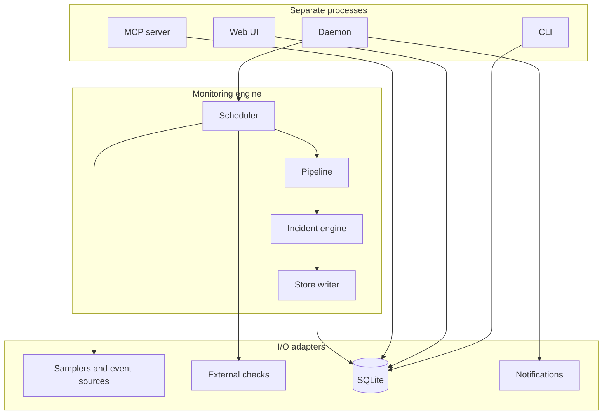

# FTMON

<!-- markdownlint-disable MD033 -->
<!-- HTML is needed to size the large source mark. -->
<p align="center">
  
</p>
<!-- markdownlint-enable MD033 -->

FTMON is a lightweight, local systems monitor for Linux desktops, workstations,
and standalone servers. It detects problems such as memory leaks, CPU hogs,
disks filling, service failures, and notable journal events while keeping
bounded metric history on the monitored machine.

It is designed for people who need more history and alerting than `htop` or
`btop`, but do not need a central monitoring stack such as Nagios, Zabbix, or
Prometheus and Grafana for one independently managed server.

> **Development status:** FTMON v2 is pre-release software. Interfaces and data
> formats may change before the first stable release.

**Live demo:** Explore the read-only interface at
[demo.ftmon.org](https://demo.ftmon.org/). It uses clearly labelled synthetic
data and does not monitor the demo server or expose an operational FTMON
installation.

## Architecture

FTMON runs as separate processes on one host. The daemon samples the system,
evaluates declarative TOML monitors, and writes to a local SQLite database; the
CLI, loopback web dashboard, and stdio MCP server read the same store (and
perform a few narrow writes such as ack and draft approval). Monitor
definitions are data validated at load time, not code loaded into the daemon.



The web UI listens on loopback only; MCP uses stdio. For design detail and
layering rules, see [DESIGN.md](DESIGN.md).

## Why FTMON?

- Runs locally as your user or a dedicated service account, without a central
  monitoring server or cloud account.
- Provides a CLI and accessible offline web dashboard with historical charts.
- Stores metrics and incidents in SQLite with bounded retention.
- Uses editable, declarative TOML monitor definitions.
- Sends durable alerts through email, ntfy, generic webhooks, or desktop
  notifications, with each channel retrying independently.
- Offers a local stdio MCP server for AI-assisted investigation and definition
  drafting, with explicit user approval for changes.
- Ships deterministic unit and end-to-end tests for its monitoring behavior.

## A practical monitor for one server

FTMON is suitable for a small hosted server, VPS, home server, or lab machine
that needs dependable local monitoring without operating a separate monitoring
platform. The server profile disables desktop popups, runs under a dedicated
unprivileged account, retains history locally, and can notify an administrator
through remote channels when an incident opens or recovers.

The operational dashboard remains bound to loopback and is reached through an
SSH tunnel. This keeps the unauthenticated management interface off the public
Internet while still making it useful on a remote headless host. A hardened
systemd unit and complete single-server installation procedure are provided in
the [installation guide](docs/install.md#dedicated-single-server-service).

### Bring your own checks

FTMON opens the collection boundary without turning the daemon into a general
plugin host. Administrators can register
local scripts or separately installed Nagios-compatible plugins, then use
ordinary declarative monitor definitions to add confirmation, incidents,
notifications, history, baselines and Trends over their returned performance
data.

That means an existing HTTP, TLS-certificate, DNS, mail, database, UPS or sensor
check can answer “is it broken now?”, while FTMON adds “has it been degrading?”
and “what changed before the incident?” The executable remains outside FTMON;
AI-authored definitions may reuse an approved alias but cannot introduce a
command or credentials. See [External checks](docs/external-checks.md),
[Why FTMON?](docs/why-ftmon.md), and the normative contract in
[SPEC.md](SPEC.md#64-administrator-registered-external-checks).

## Quick start

FTMON requires Python 3.11 or newer and
[uv](https://docs.astral.sh/uv/).

```sh
git clone https://github.com/dannysheehan/ftmon.git
cd ftmon
uv sync
uv run ftmon init --profile desktop
uv run ftmon check
uv run ftmon daemon
```

In another terminal, start the local dashboard:

```sh
uv run ftmon web
```

Then open <http://127.0.0.1:8420/>. FTMON binds only to loopback and the web UI
loads no external assets.

For a headless single server, initialize with `--profile server`. This writes
explicit settings with desktop popups disabled; remote ntfy, webhook, and SMTP
channels use environment or protected-file credential references and maintain
independent durable retry state.

For a user-level service or a hardened dedicated `ftmon` server account,
follow the [installation guide](docs/install.md). The operational dashboard
stays on loopback; reach it remotely with an SSH tunnel rather than exposing
the unauthenticated UI through a public reverse proxy.

The live [public demonstration](https://demo.ftmon.org/) is a different,
GET-only application over deterministic synthetic data. Its reproducible DNS,
Caddy, systemd, verification, update, and rollback runbook is in the
[installation guide](docs/install.md#publish-the-synthetic-demo-website).
Never expose an operational FTMON database as a demo.

## Documentation

- [User manual](docs/manual.md) — concepts, daily use, tuning, trends, and
  troubleshooting.
- [Installation guide](docs/install.md) — `uv`, systemd, web, MCP, actions, and
  backups.
- [Monitor definition reference](docs/definitions.md) — TOML schema, expression
  language, and examples.
- [External checks](docs/external-checks.md) — scripts, Nagios plugins,
  performance-data mappings, privileges, and security boundaries.
- [Extra monitors](extra-monitors/) — tested integration recipes for
  separately installed checks.
- [FTMON Exchange](https://exchange.ftmon.org/) — the generated, searchable
  public view of the curated extra-monitor catalogue.
- [Product specification](SPEC.md) and [technical design](DESIGN.md) — normative
  behavior, rationale, architecture, and requirement IDs.
- [Contributing guide](CONTRIBUTING.md) — development and documentation
  standards.
- [Documentation drift audit (M10)](docs/drift-audit-m10.md) — recorded DO-09
  pass for the pre-v1.0 release window.
- [Exchange publishing guide](docs/exchange.md) — local preview, GitHub Pages,
  custom-domain verification and rollback.
- [Shared AI skills](docs/ai-skills.md) — reviewed contribution workflows,
  trust model, and optional Codex/Claude installation.
- [Why FTMON?](docs/why-ftmon.md) — product positioning, intended users, and
  the value of extensible checks.

## Original FTMON

This repository is a from-scratch Python successor to the original **Fast Track
Systems Monitor**, a Perl monitoring engine first published in 2002. The
original GPLv2 project and its downloads remain available from the
[official FTMON project on SourceForge](https://sourceforge.net/projects/ftmon/).

The original source is not included in this repository. Keeping the projects
separate makes their provenance and licensing boundaries clear: this v2
repository is MIT licensed, while the original SourceForge project is GPLv2.

## Development

```sh
uv sync
uv run ruff check src tests
uv run pytest -q
```

Tests reference stable requirement IDs from [SPEC.md](SPEC.md). When changing
behavior, update the relevant specification, design rationale, tests, and user
documentation together.

## License

FTMON v2 is available under the [MIT License](LICENSE). The separately published
original FTMON project retains its own GPLv2 license.
