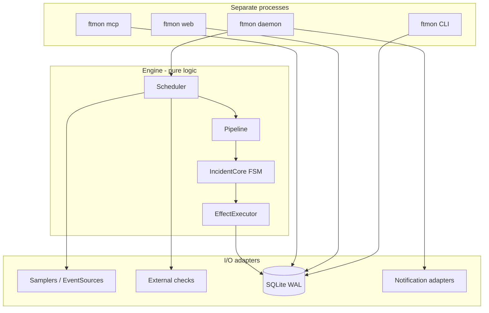

# FTMON v2 — Repository Review 3

**Date:** 2026-07-12  
**Reviewer:** AI-assisted whole-repository review (Cursor Agent)  
**Scope:** Full tree at commit `89e6a3a` (post-M9.3)  
**Spec:** SPEC.md v0.12, DESIGN.md v0.9  
**Package:** `2.0.0a1` (pre-release)

This is the third recorded repository review. Review 1 (`CODEX-SPEC-REVIEW.md`,
2026-07-10) focused on the specification. Review 2 (2026-07-12, incorporated
into SPEC v0.12 §21) audited the whole tree and established milestone M10
release gates. Review 3 revisits the repository after M9 (external checks),
M9.1–M9.3 (extra-monitors, Exchange, AI skills), and PyPI packaging work.

Per DO-09, review artifacts are not operator documentation. This file is a
maintainer-facing audit record, not part of the user manual.

---

## Executive summary

FTMON v2 is a **well-architected, spec-driven local monitor** with unusually
strong engineering discipline for a pre-release project: frozen incident logic,
clock injection enforced by tests, machine-checked requirement traceability,
deterministic CI, and a clear MIT/GPL licensing boundary.

The implementation has outpaced its **evidence base**. Code, tests, and
traceability are strong; operational claims (30-day soak, security-by-construction
proof, documentation drift) remain unweathered. **v1.0 is not ready** — that is
expected and now explicitly gated by M10.

| Area | Verdict |
| --- | --- |
| Architecture | Strong — intentional layering, pure FSM, single-tick transactions |
| Code quality | Strong — ruff clean, ~12k LOC src, rationale-led docstrings |
| Test suite | Strong — 447 passed, 1 skipped, fixture-driven e2e |
| Traceability | Good but incomplete — 83.5% covered, 29 IDs pending |
| Security | Appropriate for loopback single-user; 3 SE-* IDs still pending |
| Documentation | Broad and usable; no machine drift check (DO-09) |
| Release readiness | **Not met** — TS-17 soak not started, TS-18 pending non-empty |

**Bottom line:** Continue toward v1.0 via M10. Fix two concrete bugs (ack
metadata wipe, web definition-load inconsistency) and harden action-script trust
before tagging stable.

---

## Review method

1. Read SPEC.md, DESIGN.md, CLAUDE.md, CONTRIBUTING.md, and milestone changelog.
2. Survey package layout (`src/ftmon/`, 66 Python modules; `tests/`, 41 test files).
3. Run the contributor gate: `uv run ruff check src tests`, `uv run pytest -q`.
4. Analyse traceability: `tests/reqindex.json`, `tests/traceability_pending.json`,
   `tools/gen_reqindex.py --check`.
5. Deep-read composition root and security-sensitive modules: `daemon.py`,
   `engine/incidents.py`, `engine/pipeline.py`, `engine/effects.py`,
   `checks/runner.py`, `checks/registry.py`, `web/app.py`, `store/writer.py`,
   `mcp_server.py`, `engine/actions.py`.
6. Compare findings against SPEC v0.12 review dispositions and M10 gates.

---

## Project snapshot

FTMON v2 is a lightweight, local-first, single-host Linux systems monitor.
It detects memory leaks, CPU hogs, disk fill, service failures, and journal
events; stores bounded metric history in SQLite; and exposes a CLI, loopback
web dashboard, and stdio MCP server.

| Metric | Value |
| --- | --- |
| Commits on `main` | 47 |
| Source LOC (Python) | ~12,073 |
| Test LOC (Python) | ~8,405 |
| Test files | 41 |
| CI tests passing | 447 (+ 1 skipped, 5 deselected realsystem) |
| Testable requirements | 176 |
| Covered by tests | 147 (83.5%) |
| Pending traceability | 29 (16.5%) |
| Built-in monitor definitions | 8 |
| Extra-monitor recipes | 1 (`http-tls`) |
| Runtime dependencies | 7 (psutil, platformdirs, mcp, starlette, uvicorn, jinja2, tomli-w) |

Milestones M1–M9.3 are landed. M10 (release readiness) is the remaining gate
before v1.0.

---

## Strengths

### Spec-driven development that actually works

Every requirement has a stable ID. Tests cite IDs in bracketed docstrings;
`test_traceability.py` enforces index freshness, coverage completeness, and a
ratchet (no ID may be both covered and pending). This is rare in open-source
projects and makes AI-assisted implementation auditable.

### Architecture highlights

**Pure incident engine** (`engine/incidents.py`) — table-testable state machine
with no I/O. Effects are frozen datatypes; `EffectExecutor` handles persistence.
Changes require spec amendments (FROZEN per DESIGN).

**Single-tick transaction** (`store/writer.py`, `daemon.py`) — one
`BEGIN IMMEDIATE` per tick. Actions and notification delivery run post-commit,
so subprocess timeouts cannot block the writer (PM-03, AC-02, NO-04).

**Expression language isolation** (`expr/`) — stdlib-only, never raises (EX-06),
three-valued logic for missing data. Enforced by layering lint in `test_core.py`.

**Clock injection** (TS-03) — `time.time`/`time.sleep` only in `clock.py`.
All business logic receives an injected `Clock`. Enables deterministic e2e with
`ControlledClock`.

**External checks without plugin loading** (`checks/`) — administrator-registered
argv only, no shell, scrubbed env, process-group kill on timeout, trusted-executable
validation. Nagios and FTMON JSON adapters are strict. AI cannot create check aliases
(EC-01).

**Bounded collection boundary** — extra-monitors recipes, Exchange catalogue, and
AI skills are reviewed, testable, and inert at publication time. Third-party
executables remain separately installed (XR-*, AS-*).

### Test infrastructure

- Pure incident table tests (`test_incidents.py`) — confirmation, ladder,
  backoff, flapping, ack, escalation.
- Real daemon e2e with controlled clock (`test_daemon_e2e.py`).
- Kill-9 durability bound for notification duplicates (NO-04).
- Security: Host header rejection, XSS escaping, CSP (`test_web.py`);
  secret handling (`test_config_secrets.py`); check trust (`test_external_checks.py`).
- CI matrix on Python 3.11 and 3.13; `uv sync --locked`; full pytest gate.

### Documentation and operator experience

`docs/manual.md`, `docs/install.md`, `docs/definitions.md`, and
`docs/external-checks.md` are substantive. A live synthetic demo runs at
[demo.ftmon.org](https://demo.ftmon.org/). PyPI metadata and trusted-publishing
workflow landed in recent commits.

---

## Release readiness (M10 gates)

SPEC v0.12 added three requirements from Review 2. None are satisfied yet.

### TS-17 — 30-day two-host soak

**Status:** Not started.

Before v1.0, FTMON must complete ≥30 consecutive days on two real hosts
(desktop + server profile) with no unexplained daemon restarts, RB-01 budgets
held, and evidence attached to release notes.

**Recommendation:** Start the soak clock now on at least one developer machine
and one server-profile deployment. Record `self` monitor metrics, doctor output,
and incident history weekly.

### TS-18 — Zero pending traceability

**Status:** 29 IDs remain (target: 0 at v1.0).

Burn-down order per spec: `SE-*` first, then `UI-*`/`PL-*`, then the rest.

| Prefix | Pending count | Notes |
| --- | ---: | --- |
| SE | 3 | SE-01, SE-02, SE-03 — security-by-construction |
| UI | 5 | UI-03, UI-04, UI-06, UI-07, UI-08 |
| TS | 5 | TS-02, TS-06, TS-07, TS-17, TS-18 |
| MD | 7 | Definition schema edges |
| PL | 4 | Platform seam enforcement |
| DM | 1 | DM-16 capacity worksheet |
| PM | 1 | PM-05 |
| RB | 1 | RB-01 |
| VC | 1 | VC-02 |
| XR | 1 | XR-05 |

Several pending IDs have **behavior already tested** under adjacent requirement
tags (e.g. UI-08 hardening appears in tests citing TS-07/UI-02/SE-02). A quick
win is adding correct `[REQ-ID]` brackets to existing tests.

### DO-09 — Documentation-drift audit

**Status:** Manual only; no machine check.

TS-01 covers SPEC↔tests, not prose docs. Each milestone with user-visible
changes should end with a recorded audit pass over `docs/manual.md`,
`docs/install.md`, `docs/definitions.md`, and `README.md`.

**Recommendation:** Add a lightweight checklist to M10 work packages. Consider
a future `tools/audit_docs.py` that verifies CLI `--help` subcommands and
documented paths exist.

---

## Findings and dispositions

### Critical — fix before v1.0

#### F-01: Ack metadata wiped on incidental upsert

`EffectExecutor.apply()` always writes `ack_by=None, ack_ts=None` on every
upsert, including silent downgrades of acked incidents:

```82:99:src/ftmon/engine/effects.py
        self._writer.upsert_incident(
            ...
            ack_by=None,
            ack_ts=None,
            ...
        )
```

After restart, ack provenance can be lost while in-memory state was `"acked"`.

**Disposition:** Fix. Carry `ack_by`/`ack_ts` in `IncidentCore` or preserve
existing columns on upsert when state remains acked. Add an integration test.

#### F-02: Web dashboard loads definitions without check validation

The daemon loads monitors with `check_aliases` and `require_checks=True`:

```299:305:src/ftmon/daemon.py
        defs, errors = definitions.load_dir(
            self.paths.monitors_dir,
            actions_dir=self.paths.actions_dir,
            require_actions=True,
            check_aliases=frozenset(self.check_registry),
            require_checks=True,
        )
```

The operational dashboard does not:

```119:121:src/ftmon/web/app.py
            defs, errors = loader.load_dir(
                paths.monitors_dir, actions_dir=paths.actions_dir, require_actions=True
            )
```

Draft approval and enable/disable routes do pass `check_aliases`; the main
dashboard may show monitors the daemon would reject.

**Disposition:** Fix. Align dashboard `load_dir` with daemon parameters.

### High — address in M10

#### F-03: Action scripts have weaker trust than external checks

`ActionRunner` checks symlink, file, and executable bit but not owner UID or
group/world writability (`engine/actions.py`). External checks enforce
`st_uid in {0, euid}` and reject `S_IWGRP|S_IWOTH` (`checks/runner.py`).

A world-writable file in `actions/` could be swapped between validation and
execution.

**Disposition:** Fix. Mirror external-check executable validation in
`ActionRunner`.

#### F-04: Tick data loss on commit failure

`TickWriter.commit_tick()` clears all pending buffers in `finally` even after
`rollback()`. A transient SQLite error drops the entire tick with no retry.

**Disposition:** Fix or harden. Log loudly; consider retaining buffers for
retry on transient errors.

#### F-05: Retention self-events lag one tick

`_run_retention()` may call `writer.add_event()` after `commit_tick()`, so
degradation notes persist on the next tick (or are lost on crash).

**Disposition:** Defer to M10 unless soak reveals lost events. Move retention
self-events before commit or add a small post-tick event flush.

### Medium — track, not blocking

#### F-06: `DaemonCore` complexity

`daemon.py` (~580 lines) orchestrates definitions reload, incidents, events,
retention, dispatch, config/channel reload, and check registry. Testable via
injection but increasingly hard to reason about holistically.

**Disposition:** Accept for now. Extract `DefinitionManager` or
`IncidentCoordinator` when adding post-v1.0 features.

#### F-07: Confirm counters are memory-only

Documented trade-off: restart marks owning rung as confirmed. Conservative for
open incidents; brief false-positive before restart could reopen without
re-confirmation.

**Disposition:** Accept (DESIGN D3). Document in operator manual.

#### F-08: Starlette TestClient deprecation warning

`test_daemon_e2e.py` triggers `StarletteDeprecationWarning` (httpx → httpx2).
Noted in SPEC v0.12; folded into M10 dependency sweep.

**Disposition:** Defer to M10.

#### F-09: Loopback UI has no auth (by design)

Any local process can ack incidents, approve drafts, and toggle monitors via
POST. Acceptable per NG-05 on loopback; worth noting for shared-login hosts
and SSH-tunneled server deployments.

**Disposition:** Accept. Add a short security note to `docs/install.md` server
section.

### Low — informational

#### F-10: MCP `top_consumers` uses f-string SQL

`mcp_server.py` interpolates `agg_sql` from a fixed dict — safe today, fragile
if extended.

**Disposition:** Note. Prefer parameterized queries if extended.

#### F-11: `daemon.py` module docstring says "M1 scope"

Features from M2–M9 are present; docstring is stale.

**Disposition:** Cosmetic. Update when touching the file.

---

## Security assessment

| Control | Implementation | Status |
| --- | --- | --- |
| Loopback-only web | `uvicorn.run(..., host="127.0.0.1")` | Verified |
| DNS rebinding / CSRF | `SecurityMiddleware`: Host allowlist, POST Origin check | Tested (partial ID citation) |
| CSP / nosniff | SE-02 headers on web responses | Tested via SE-02-adjacent tests |
| File permissions | `0700` dirs, `0600` files, DB `0600` | Implemented |
| Secrets | `SecretRef`/`SecretValue`, symlink rejection, writability checks | Tested |
| External checks | No shell, scrubbed env, process-group kill, trusted exe | Tested |
| Check registry | Atomic publish, rejects symlinks/world-writable paths | Tested |
| MCP authority | Drafts and acks only; cannot enable monitors or run actions | Tested |
| Actions | No shell, post-commit, rate-limited, capped output | Tested; trust gap (F-03) |

SE-01 (attack surface by construction), SE-02 (untrusted string escaping), and
SE-03 (no legacy CipherSaber) remain in the pending list despite substantial
partial coverage elsewhere. **Burn these down first** per TS-18.

---

## Architecture assessment



**Layering rule** (enforced by lint test): `expr` imports only stdlib;
`sources`, `store`, `engine` do not cross-import except `engine → sources.base`;
`daemon`/`mcp_server`/`web`/`cli` are composition roots.

**Notable design wins:**

- Definitions are data, never code (TOML + restricted expressions).
- Source-once-per-tick snapshot sharing (SA-06).
- At-least-once notification delivery via durable outbox (NO-04).
- Fail-soft config: bad monitor files keep last-good state (PM-04).

**Weakness:** Loose typing at `engine → store` boundary (`writer` untyped to
avoid import cycles). Acceptable but increases refactor risk.

---

## Test and traceability assessment

### What is well covered

| Domain | Representative tests |
| --- | --- |
| Incidents | `test_incidents.py` — exhaustive pure FSM |
| Expression language | `test_expr_eval.py`, `test_expr_parse.py`, `test_tribool.py` |
| Engine integration | `test_m2_integration.py`, `test_scenarios_m4.py` |
| E2E daemon | `test_daemon_e2e.py` — real binary, controlled clock |
| Store / retention | `test_store.py`, `test_retention.py` |
| Notifications | `test_notification_dispatch.py`, `test_notify_remote.py` |
| External checks | `test_external_checks.py`, `test_check_registry.py`, `test_external_sampler.py` |
| MCP | `test_mcp.py` — 38 requirement citations |
| Web | `test_web.py`, `test_web_demo.py` |
| Extra-monitors / Exchange / Skills | `test_recipes.py`, `test_exchange.py`, `test_shared_skills.py` |

### Gaps to close for TS-18

1. Add `[SE-01]`, `[SE-02]`, `[SE-03]` brackets to existing security tests.
2. Add explicit tests for `PL-01` platform seam boundary (or cite existing
   fixture/sampler tests).
3. Cover `DM-16` capacity degradation order with a worksheet-driven test.
4. Cite `UI-03`–`UI-08` on existing web tests where behavior is already asserted.
5. Add test for ack persistence through silent downgrade (F-01).
6. Add negative test for world-writable action script (F-03).

### Realsystem tier

Five tests deselected by default (`-m 'not realsystem'`). Appropriate for CI
determinism. Server deployment smoke (`e2e_real/test_server_deployment.py`)
is opt-in — run periodically during TS-17 soak.

---

## Documentation assessment

| Document | Quality | Drift risk |
| --- | --- | --- |
| `README.md` | Clear entry point, demo link, quick start | Medium — external claims (demo, Exchange) need periodic verification |
| `docs/manual.md` | Substantive user guide | Medium — grows per milestone; no auto-check |
| `docs/install.md` | Complete server + desktop paths | Medium — Caddy/systemd steps are environment-specific |
| `docs/definitions.md` | Normative for monitor authors | Low — tied to schema validator |
| `docs/external-checks.md` | Clear EC contract | Low — tested by recipe contract |
| `CLAUDE.md` / `AGENTS.md` | Accurate post-Review 2 rewrite | Low |
| `SPEC.md` / `DESIGN.md` | Authoritative, changelog-maintained | Low |

**DO-09 action:** Schedule a manual audit before v1.0 tag. Verify README
claims (demo URL, Exchange URL, PyPI package name) against live endpoints.

---

## Comparison to Review 2 (SPEC v0.12)

| Review 2 finding | Review 3 status |
| --- | --- |
| Code/tests/traceability strong | Confirmed — 447 tests, 83.5% coverage |
| Operational claims unweathered | Still true — soak not started |
| SE-01..03 pending | Still pending (3 IDs) |
| No docs drift check | Still manual (DO-09) |
| CLAUDE.md described Perl architecture | Fixed in v0.12 |
| Review artifacts in tree | Removed per DO-09; this file reintroduced at owner request |
| Starlette deprecation | Still present (1 warning) |

**New since Review 2:** M9 external checks, extra-monitors recipe, Exchange
publisher, AI skill contract, PyPI packaging — all landed with tests and
generally high quality.

---

## Prioritized recommendations

| Priority | Action | Requirement / finding |
| ---: | --- | --- |
| 1 | Start 30-day two-host soak with weekly evidence capture | TS-17 |
| 2 | Fix ack metadata wipe on upsert + test | F-01 |
| 3 | Align web dashboard `load_dir` with daemon check validation | F-02 |
| 4 | Harden action-script trust (mirror check runner) | F-03, SE-01 |
| 5 | Burn down SE-* pending IDs with explicit tests/brackets | TS-18 |
| 6 | Bracket existing tests for UI-*, PL-*, MD-* pending IDs | TS-18 |
| 7 | Run DO-09 documentation-drift audit | DO-09 |
| 8 | Address `commit_tick` failure data loss | F-04 |
| 9 | Resolve Starlette/httpx2 deprecation in test harness | F-08 |
| 10 | Add shared-login security note to server install docs | F-09 |

---

## Conclusion

FTMON v2 is **implementation-rich and evidence-poor** — the right shape for
an alpha, and the wrong shape for v1.0 today. The codebase demonstrates mature
systems thinking: pure incident logic, honest timeout semantics, bounded
external-check boundary, and traceability machinery that most projects never
build.

The path to v1.0 is clear and already specified: run the soak (TS-17), empty
the pending list with security first (TS-18), audit the prose docs (DO-09), and
close the small set of concrete bugs identified here. None of the findings
suggest architectural rework; they are finish-line hardening.

**Review 3 verdict:** Continue to M10. Do not tag v1.0 until TS-17 and TS-18
are satisfied.

---

## Appendix: validation commands run

```sh
uv run ruff check src tests          # All checks passed
uv run pytest -q                     # 447 passed, 1 skipped, 5 deselected
python3 tools/gen_reqindex.py --check  # reqindex.json up to date
```
